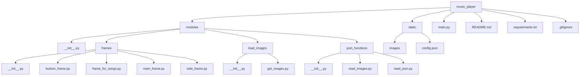

1)тема проекта с какой целью он создавался 
2)как запустить проект(устновка пайтон, установка с гита , создавние вирутального окружения , python main.py)
3)структура requirements описание кажого модуля , с какой целью они используються в проекте
4)схема проекта(figjam or in readme)
5)описание каждого пакета в modules и файлы в нутри пакета(код) , коментарии на англ или на укр 
6)с какой целью каждый файл
7)ссылка на библиотеки где брал информацию
8)какие были проблемы при создании проекта , как решил проблему с которой столкнулся
9)сделать работу над ошибками(потоки , не создавал классы)
10)висновок на укр и на англ(с чем помог проект, как он меня прокачал , чем он был мне полезен)
### Table of contents
[Project description](#headers)  

[Getting started](#getting_started) 

[Modules description](#modules)

[Scheme of project](#scheme)

[Package description](#package_description)


# Music PLayer
<a name="headers"><h2>About project</h2></a>

The main goal of developing this program was to improve my skills in working with the customtkinter library and gain 
experience in creating functional applications with an attractive graphical interface in Python.
Of course, this program is not perfect, but this project served as a learning tool to deepen my understanding 
of working with custom interface elements, troubleshooting code issues, and properly organizing files within a project.

Moreover, the development of this project helped me better understand how to work with events and use various libraries 
to create a unified functional application. The result is a music player that can be used as a foundation for further 
improvements and the addition of new features, such as retrieving relevant information from external music services.

<details>
<summary>Ukraine version</summary>
Головною метою розробки цієї програми було вдосконалення своїх навичок роботи з бібліотекою customtkinter, 
та отримання досвіду у створенні функціональних додатків із привабливим графічним інтерфейсом у Python.
Звісно не можна сказати що ця програма ідеальна, але цей проєкт слугував меня як навчальний інструмент для поглиблення 
розуміння роботи з кастомними елементами інтерфейсу, вирішування помилок у коді, та правильною розтановкою файлів.

Окрім того,розробка цього проєкту допомогла краще зрозуміти, як працювати з подіями, 
також використовування різних бібліотек для створення єдиного функціонального додатку. Результатом став музичний плеєр, 
який можна використовувати як базу для подальшого вдосконалення та додавання нових функцій, 
таких як брати потрібну інформацію із зовнішніх музичних сервісів.
</details>

<a name="getting_started"><h1>Getting started</h1></a>
Below will be instructions on how you can download this project to your device.

## Installing python
This is an example of how to install python if you never use him
- Download the Python Installer
    - Go to the official [Python website](https://www.python.org)
    - Navigate to the Downloads section. The website automatically detects your operating system and displays the appropriate version.
- Choose the Right Version
    - For most users, the latest stable version is recommended. But if you don't have the latest version, try downloading another one.
- Download the Installer
    - Click on the Download Python button. This button will be in the top right corner of your screen.
- Customize Installation Options 
    - Check the box "Add Python to PATH" at the bottom of the installer window. This step is crucial for running Python from the command line
    - Click Customize installation if you want to select additional options, but the default settings work fine for most users.
- Install python
    - Finnaly you can click the Install Now button and wait for the installation to complete.
- Verify the Installation
    - After installation, open your terminal or command prompt.
        <details>
        <summary> Operating system</summary>
        - On Windows: Press Win + R, type cmd, and press Enter.
        - On macOS/Linux: Open the Terminal application.
        </details>
    - Type ```python --version``` or ```python3 --version``` and press Enter.
    - If Python is installed correctly, you will see the installed version displayed

If you still don't get how to install python, you can watch [here](https://www.youtube.com/watch?v=YKSpANU8jPE)


## Installing this project
1. Clone the project
    - Went to the main page of project on github.
    - Click the green "Code" button located at the top right.
    - Select the HTTPS option and copy the project URL.
2. Open project in an IDE
    - Launch your preferred IDE(Vscode , PyCharm or another one)
    - Open it , and select "Open Folder" option to navigate to and open the directory where the project was cloned.
    - Press Control + J or just create new terminal , and write this:
    ```python
    git clone <repository_url>
    ```
3. Prepare the project for use
    - Go to the main project folder
        ```python  
        cd music_player
        ```
4. Сreate a virtual environment

    For macOS/Linux:

        python3 -m venv venv
    For Windows:

        python -m venv venv
4. Activate the Virtual Environment

    On macOS/Linux:

        source venv\Scripts\activate
    On Windows:

        venv\Scripts\activate
5. Install Project modules
    - Once the virtual environment is active, install the required libraries by running:

        ``` 
        pip install -r requirements.txt 
        ```
6. Launch program
    - For start the Music Player, use the following command:
        ``` python
        python main.py
        ```


<a name="modules"><h1>MODULES FOR PROGRAM</h1></a>


### MODULES FOR DOWNLOADING

* **customtkinter** - To create a music player GUI/Для створення графічного інтерфейсу музикального плеєру
* **pygame** - Loading and playing music for music_app/Завантаження та програвання музики для додатку
* **pillow** - For open and process image files before passing them to customtkinter/Для відкриття та обробки файлів зображень перед передачею їх у customtkinter

### BASE MODULES PYTHON

* **os** - searching absolute path
* **threading** - Used to create and manage streams so that you can play music continuously without stuttering or errors/Використовується для створення потоків і керування ними, для того щоб можна було безперервно програвати музику без зависань та помилок
* **random** - Used for the function of playing random music/Використовувся для функції програвання рандомної музики
* **json** - Used for reading JSON files and images for project/Використовувався для отримання необхідної інформації з JSON файлів, а також для зчитування шляхів до зображень.

<a name="scheme"><h1>Scheme of the project</h1></a>

<a name="package_description"><h1>Package description</h1></a>
After looking at the main scheme of the project, you can now understand why each package and the modules in them are needed.


    


        


```
hahahahahahah
```

```python
    print(dfkmfd)
    def ():
        print()
```

<a href="https://fonts.google.com/selection"></a>

<a >

<!-- start:code block -->
# Clone this repository
git clone https://github.com/Pranichek/Music_player
cd papermark

# Install dependencies
npm install

# Copy the example .env file
cp .env.example .env

# Initialize the database
npx prisma generate
npx prisma db push

# Run the app
npm run dev

# Open https://github.com/Pranichek/Music_player in your browser
open https://github.com/Pranichek/Music_player
<!-- end:code block -->


## Getting started
*This is readme file about my project music player.*


**This is readme file about my project music player.**


***This is readme file about my project music player.***

~~*__This is readme file about my project music player.__*~~


Привет это [обычная ссылка в строке](https://www.google.com)

- Первый 1. Пункт 1.
- Второй 1. Пункт 2.
- Третий 1. Пункт 3.


- [X] Write music player
- [ ] nothing
- [X] add thread


- Уровень списка 1. Пункт 1.
    - Уровень списка 2. Пункт 1.
- Уровень списка 1. Пункт 2.
    - Уровень списка 2. Пункт 1.
    - Уровень списка 2. Пункт 2.
- Уровень списка 1. Пункт 3.
    - Уровень списка 2. Пункт 1.
        - Уровень списка 3. Пункт 1.
        - Уровень списка 3. Пункт 2.
           - Уровень списка 4. Пункт 1.