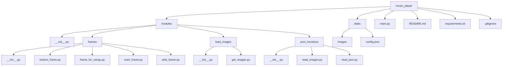

1)тема проекта с какой целью он создавался 
2)как запустить проект(устновка пайтон, установка с гита , создавние вирутального окружения , python main.py)
3)структура requirements описание кажого модуля , с какой целью они используються в проекте
4)схема проекта(figjam or in readme)
5)описание каждого пакета в modules и файлы в нутри пакета(код) , коментарии на англ или на укр 
6)с какой целью каждый файл
7)ссылка на библиотеки где брал информацию
8)какие были проблемы при создании проекта , как решил проблему с которой столкнулся
9)сделать работу над ошибками(потоки , не создавал классы)
10)висновок на укр и на англ(с чем помог проект, как он меня прокачал , чем он был мне полезен)
<a name="articles"><h3>Table of contents</h3></a>

[Project description](#headers)  

[Getting started](#getting_started) 

[Modules description](#modules)

[Scheme of project](#scheme)

[Package description](#package_description)


# Music PLayer
<a name="headers"><h2>About project</h2></a>

The main goal of developing this program was to improve my skills in working with the customtkinter library and gain 
experience in creating functional applications with an attractive graphical interface in Python.
Of course, this program is not perfect, but this project served as a learning tool to deepen my understanding 
of working with custom interface elements, troubleshooting code issues, and properly organizing files within a project.

Moreover, the development of this project helped me better understand how to work with events and use various libraries 
to create a unified functional application. The result is a music player that can be used as a foundation for further 
improvements and the addition of new features, such as retrieving relevant information from external music services.

<details>
<summary>Ukrainian version</summary>
Головною метою розробки цієї програми було вдосконалення своїх навичок роботи з бібліотекою customtkinter, 
та отримання досвіду у створенні функціональних додатків із привабливим графічним інтерфейсом у Python.
Звісно не можна сказати що ця програма ідеальна, але цей проєкт слугував меня як навчальний інструмент для поглиблення 
розуміння роботи з кастомними елементами інтерфейсу, вирішування помилок у коді, та правильною розтановкою файлів.

Окрім того,розробка цього проєкту допомогла краще зрозуміти, як працювати з подіями, 
також використовування різних бібліотек для створення єдиного функціонального додатку. Результатом став музичний плеєр, 
який можна використовувати як базу для подальшого вдосконалення та додавання нових функцій, 
таких як брати потрібну інформацію із зовнішніх музичних сервісів.
</details>

[⬆️Table of contents](#articles) 

<a name="getting_started"><h1>Getting started</h1></a>
Below will be instructions on how you can download this project to your device.

## Installing python
This is an example of how to install python if you never use him
- Download the Python Installer
    - Go to the official [Python website](https://www.python.org)
    - Navigate to the Downloads section. The website automatically detects your operating system and displays the appropriate version.
- Choose the Right Version
    - For most users, the latest stable version is recommended. But if you don't have the latest version, try downloading another one.
- Download the Installer
    - Click on the Download Python button. This button will be in the top right corner of your screen.
- Customize Installation Options 
    - Check the box "Add Python to PATH" at the bottom of the installer window. This step is crucial for running Python from the command line
    - Click Customize installation if you want to select additional options, but the default settings work fine for most users.
- Install python
    - Finnaly you can click the Install Now button and wait for the installation to complete.
- Verify the Installation
    - After installation, open your terminal or command prompt.
        <details>
        <summary> Operating system</summary>
        - On Windows: Press Win + R, type cmd, and press Enter.
        - On macOS/Linux: Open the Terminal application.
        </details>
    - Type ```python --version``` or ```python3 --version``` and press Enter.
    - If Python is installed correctly, you will see the installed version displayed

If you still don't get how to install python, you can watch [here](https://www.youtube.com/watch?v=YKSpANU8jPE)

[⬆️Table of contents](#articles)

## Installing this project
1. Clone the project
    - Went to the main page of project on github.
    - Click the green "Code" button located at the top right.
    - Select the HTTPS option and copy the project URL.
2. Open project in an IDE
    - Launch your preferred IDE(Vscode , PyCharm or another one)
    - Open it , and select "Open Folder" option to navigate to and open the directory where the project was cloned.
    - Press Control + J or just create new terminal , and write this:
    ```python
    git clone <repository_url>
    ```
3. Prepare the project for use
    - Go to the main project folder
        ```python  
        cd music_player
        ```
4. Сreate a virtual environment

    For macOS/Linux:

        python3 -m venv venv
    For Windows:

        python -m venv venv
4. Activate the Virtual Environment

    On macOS/Linux:

        source venv\Scripts\activate
    On Windows:

        venv\Scripts\activate
5. Install Project modules
    - Once the virtual environment is active, install the required libraries by running:

        ``` 
        pip install -r requirements.txt 
        ```
6. Launch program
    - For start the Music Player, use the following command:
        ``` python
        python main.py
        ```
[⬆️Table of contents](#articles)

<a name="modules"><h1>MODULES FOR PROGRAM</h1></a>

### MODULES FOR DOWNLOADING

* **customtkinter** - To create a music player GUI/Для створення графічного інтерфейсу музикального плеєру
* **pygame** - Loading and playing music for music_app/Завантаження та програвання музики для додатку
* **pillow** - For open and process image files before passing them to customtkinter/Для відкриття та обробки файлів зображень перед передачею їх у customtkinter

### BASE MODULES PYTHON

* **os** - searching absolute path
* **threading** - Used to create and manage streams so that you can play music continuously without stuttering or errors/Використовується для створення потоків і керування ними, для того щоб можна було безперервно програвати музику без зависань та помилок
* **random** - Used for the function of playing random music/Використовувся для функції програвання рандомної музики
* **json** - Used for reading JSON files and images for project/Використовувався для отримання необхідної інформації з JSON файлів, а також для зчитування шляхів до зображень.

<a name="scheme"><h1>Scheme of the project</h1></a>

[⬆️Table of contents](#articles)



<a name="package_description"><h1>Package description</h1></a>

# Frame package

After looking at the main scheme of the project, you can now understand why each package and the modules in them are needed.
Let's start with package frames , which contains all the files associated with application frames, and functions that help manage buttons correctly.The first file we will look at in this package will be main_frame.py , which creates the main application window.

<details>
<summary>Ukrainian version</summary>
Розглянувши основну схему проекту, тепер ви можете зрозуміти, для чого потрібен кожен пакет і модулі в них.
Почнемо з пакету frames, який містить усі файли, пов’язані з вікнами програми, і функціями, які допомагають правильно керувати кнопками. Першим файлом, який ми розглянемо в цьому пакеті, буде main_frame.py, який створює головне вікно програми.
</details>

# main_frame.py

```python
    # Importing module that can create Dekstop programs 
    # Імпортуємо необхідний модуль для створення Dekstop програм
    import customtkinter as ctk
    # Import function that can reades json files
    # Імпортуємо функція яка може читати json файли
    from ..json_functions.read_json import read_json

    # Take a list of information for create window
    # Беремо інформацію  про параметри віна із файлу config.json 
    dict = read_json(filename="config.json")

    print(dict)

    # Take the main parameters from dict which we need to create main window
    # Беремо потрібні параметри зі словаря dict для свторення вікна
    width = dict["main_frame"]["width"]
    height = dict["main_frame"]["height"]
    title = dict["main_frame"]["title"]
    main_frame_color = dict["main_frame"]["fg_color"]

    # Create new window with parameters that we take from dict
    # Створюємо головне вікно за параметрами які отримали
    app = ctk.CTk(fg_color = main_frame_color)
    # Use function that prohibits resizing the window
    app.resizable(width  = False, height = False)

    # Take a size of user screen to place window in the center
    # Дізнаємося інформацію про розмір вікна користувача 
    screen_width = app.winfo_screenwidth()
    screen_height = app.winfo_screenheight()

    # Finds the center coord of screen
    # Знаходимо центральні координати вікна , для розташування програми по центру
    x_coordinate = (screen_width // 2) - (width // 2)
    y_coordinate = (screen_height // 2) - (height // 2)


    # Set the size of the empty window and place it in the center of the screen
    # Задаємо розміру голоному вікну , та розташовуємо його по центру екрана
    app.geometry(f"{width}x{height}+{x_coordinate}+{y_coordinate}")

    # Sets the title of the window
    # Даємо назву вікну
    app.title(title)
```

[⬆️Table of contents](#articles)

After viewing the code of the main window, let's go to the file where we create the buttons located in the bottom panel of the program and their functions.

<details>
<summary>On Ukraine language</summary>
Після просмотру коду головного вікна, перейдемо до файлу де створюємо кнопки які розтошавані у нижній панелі програми , та їхніми функціями.
</details>

# buttom_frame.py
The file buttom_frame.py contains all the functions and logic for creating and managing buttons in the bottom frame of the application. 

## Modules that we need for buttom frame

Now we can look at the description of the modules and why I imported them.

<details>
<summary>Modules</summary>

```python
    # Import module pygame , that can play music
    # Імпортуємо модуль pygame , який дозволяє програвати музику
    import pygame
    # Import module random for randomizing songs
    # Імпортуємо модуль який допоможе рандомно програвати музику
    import random as r
    # Import module os for working with directories
    # Імпортуємо модуль який працює із директоріями
    import os
    # Import module that can create Dekstop programs 
    # Імпортуємо необхідний модуль для створення Dekstop програм
    import customtkinter as ctk
    # Import function that can creates thread 
    # Імпортуємо моудль який може створювати потоки 
    from threading import Thread 
    # Import module that can work with directories of computer
    # Імпортуємо модуль який може працювати із директоріями проєкту
    from customtkinter import filedialog
    # Import main frame , where we places all another frames
    # Імпортуємо головний екран , на якому можемо розташовувати всі інші фрейми
    from .main_frame import app
    # Import images for buttons
    # Імпортуємо зображення для кнопок
    from ..load_images.get_images import image_add_song, image_del_song , image_mix_songs , image_sound_up , image_sound_down
    # Import frame where we places buttons with name of songs
    # Імпортуємо фрейм на якому розташовуємо кнопки із назвами пісень
    from .frame_for_songs import frame_treks , list_songs 
    # Import all lists for manages program
    # Імпортуємо всі лісти які допомогають керувати програмою
    from .side_frame import event_pause , list_check_stop , label_for_show_name, list_flipping_song  , list_for_button, what_event
```

</details>

## Add songs to the project

<details>
<summary>Adding songs</summary>

The first time I sat down to make a project, the most basic question was how to load music from a computer into the project. 
In this part of the code description, you can see a complete description of this question.

```python

# A function wich load songs from your computer to music player
# Функціія яка завантажує музику з комп'ютера до музикального плеєра
def open_songs():
    # Choise from wich directory songs will loads to project
    # Запитуємо у користувача із якої дирикторії будемо завантажувати музику
    path = filedialog.askdirectory()
    # Checking that the user does not select an empty directory
    # Перевірка на те , щоб користувач не вибрав пусту директорію
    if path != None:
        name = ""
        # Chdir - the command changes the current working directory to the one specified in the path variable so that pygame can play music by name
        # Chdir - яка команда змінює поточну робочу директорію на вказану в змінній path , щоб pygame міг програвати музику за назвою
        os.chdir(path)
        # os.listdir - a function in Python that returns a list containing the names of the entries in the directory given by path.
        #listdir - команда повертає список файлів та папок, що знаходяться у вказаній директорії path
        songs = os.listdir(path)
        # We go through all the files and check that they have the mp3 extension
        #Перебираємо усі файли , та перевіряємо щоб вони були із розширенням mp3
        for song in songs: 
            if song.endswith(".mp3"):
                # If this is the case, then split the file into name and extension
                # Якщо це так, то розбиваємо файл на ім'я та розширення
                name , file = song.split(".mp3")
                # Create a button with song name ,  - so that the button contains the names of the songs in order, and not just the last one
                # Створення кнопки з назвою пісні , lambda - щоб кнопка містила назви пісень по порядку, а не лише останню
                button = ctk.CTkButton(master= frame_treks , text = name , command=lambda name_of_button = name:change_name_button(name_of_button= name_of_button))

                # Add button to the list of buttons
                # Додаємо кнопку до списку із кнопками
                list_for_button.append(button)

                # Add song to the list for songs
                # Додаємо пісню до списку пісень
                list_songs.append(song)

            # Pack buttons in frame_treks to display them on the screen
            # Розташовуємо кнопки із піснями за допомогою циклу, та робимо відступи у 10 пікселів
            for song in list_for_button:
                song.pack(pady = 10)

```
</details>


## Deleting song from music player

If you were to ask me which part of the project was the most difficult, I would say without hesitation that it was the song removal function.

In the first version of this function, I encountered a problem that all buttons were only passed the same song title, regardless of which button was pressed. I searched for a solution for several days and finally realized that the best option would be to use lambda functions for each button. This allowed me to determine exactly which button was pressed and remove the desired song accordingly.

Below you can see the complete solution to this problem.

<details>
<summary>Ukrainian version</summary>
Якщо б мене запитали, яка частина проєкту була найскладнішою, я б без вагань відповів, що це функція видалення пісень.

У першій версії цієї функції я зіткнувся з проблемою , що для всіх кнопок передавалася лише одна й та сама назва пісні, незалежно від того, яку саме кнопку натискали. Я шукав рішення кілька днів і, зрештою, зрозумів, що найкращим варіантом буде використання lambda-функцій для кожної кнопки. Це дозволило мені точно визначати, на яку саме кнопку натиснули, і відповідно видаляти потрібну пісню.

Нижче ви можете побачити повне рішення цієї задачі.
</details>

<details>
<summary>Dliting songs</summary>

```python
# List for manage what song need to del
# Ліст для того , щоб контролювати яку пісню треба видаляти
check_del = [False]

# A function that is immediately added for all buttons in the list_sons list; the name_of_button parameter contains the name of the button that was clicked
# Функція, яка відразу додається для всіх кнопок у списку list_sons, у параметрі name_of_button лежить назва кнопки на яку натиснули
def change_name_button(name_of_button):
    # Checking whether you clicked on the delete songs button
    # Перевіряємо чи натиснули на кнопку видалення пісень
    if check_del[0] == True:      
        # We go through the list of buttons with the names of songs to find out which one was clicked
        # Перебираємо всі кнопки з назвами пісень, та перевіряємо чи текуща кнопка совпадает с кнопкой которую нажали, та якщо так, то видаляємо її
        for button in list_for_button:
            # If the song you searched for coincides with the one you clicked on, then delete it
            # Якщо пісня яку перебирали збіглася з тією на яку натиснули, то видаляємо її
            if button._text == name_of_button:
                # If we find the right button, destroy it
                # Якщо нагшли на яку кнопку настиснули , то видаляємо її
                button.destroy()
                # Also delete a song from the list_songs
                # Також видаляємо пісню із списку де зьерігаються усі пісні, щоб її не можна було програти
                list_songs.remove(name_of_button + ".mp3")
                # Also delete the button from the list_for_button
                # Видаляємо кнопку із списка де зберігаються усі кнопки
                list_for_button.remove(button)
                # Transfer the click of the delete button False to the tracking list, so that the next song can be deleted only by clicking on the button
                # Передаємо у список відстеження натискання кнопки видалення False, щоб наступну пісню можна було видалити лише після натискання на кнопку
                check_del[0] = False
            # If already we don't have any buttons in list , clear all list
            # якщо в списку де зберігаються усі кнопки пустий, то очищаємо список
            elif len(list_songs) < 1:
                list_for_button.clear()
                
# if check_del is False, it means the delete button was not pressed
# якщо в check_del лежить False то значить кнопку видалення не натиснули
def delete_song():
    # transmit True to say that the button was pressed
    # передаємо True щоб сказати що натиснули на кнопку
    check_del[0] = True
```
</details>


    


        


```
hahahahahahah
```

```python
    print(dfkmfd)
    def ():
        print()
```

<a href="https://fonts.google.com/selection"></a>

<a >

<!-- start:code block -->
# Clone this repository
git clone https://github.com/Pranichek/Music_player
cd papermark

# Install dependencies
npm install

# Copy the example .env file
cp .env.example .env

# Initialize the database
npx prisma generate
npx prisma db push

# Run the app
npm run dev

# Open https://github.com/Pranichek/Music_player in your browser
open https://github.com/Pranichek/Music_player
<!-- end:code block -->


## Getting started
*This is readme file about my project music player.*


**This is readme file about my project music player.**


***This is readme file about my project music player.***

~~*__This is readme file about my project music player.__*~~


Привет это [обычная ссылка в строке](https://www.google.com)

- Первый 1. Пункт 1.
- Второй 1. Пункт 2.
- Третий 1. Пункт 3.


- [X] Write music player
- [ ] nothing
- [X] add thread


- Уровень списка 1. Пункт 1.
    - Уровень списка 2. Пункт 1.
- Уровень списка 1. Пункт 2.
    - Уровень списка 2. Пункт 1.
    - Уровень списка 2. Пункт 2.
- Уровень списка 1. Пункт 3.
    - Уровень списка 2. Пункт 1.
        - Уровень списка 3. Пункт 1.
        - Уровень списка 3. Пункт 2.
           - Уровень списка 4. Пункт 1.