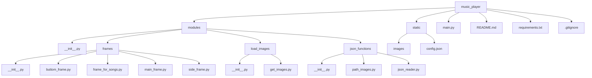

1)тема проекта с какой целью он создавался 
2)как запустить проект(устновка пайтон, установка с гита , создавние вирутального окружения , python main.py)
3)структура requirements описание кажого модуля , с какой целью они используються в проекте
4)схема проекта(figjam or in readme)
5)описание каждого пакета в modules и файлы в нутри пакета(код) , коментарии на англ или на укр 
6)с какой целью каждый файл
7)ссылка на библиотеки где брал информацию
8)какие были проблемы при создании проекта , как решил проблему с которой столкнулся
9)сделать работу над ошибками(потоки , не создавал классы)
10)висновок на укр и на англ(с чем помог проект, как он меня прокачал , чем он был мне полезен)
<a name="articles"><h3>Table of contents</h3></a>

# Project Description  
[Project description](#headers)

# Getting Started  
[Getting started](#getting_started)

# Modules Description  
[Modules description](#modules)

# Project Scheme  
[Scheme of project](#scheme)

# Package Description  
-   [Package description](#package_description)
    - [Main __init__.py of package modules](#main_init)
    - [Frame package](#frame_package)
        -   [File __init__.py](#init_frames)
        -   [File main_frame.py](#main_frame.py)
        -   [File buttom_frame.py](#buttom_frame.py)
            -   [Module description in file button_frame.py](#button_frame_modules)
            -   [Function wich load songs to project](#load_songs)
            -   [Function wich delete songs](#delete_songs)
            -   [Functions for editing volume](#edit_volume)
            -   [Function that play random songs](#random_songs)
            -   [Create buttons for buttom panel](#buttons_buttom_panel)
        -   [File frame_for_songs.py](#frame_for_songs.py)
        -   [File side_frame.py](#side_frame.py)
            -   [Module description in file side_frame.py](#modules_side_frame)
            -   [Function wich plays music in turn](#queu_music)
            -   [Function wich skip song to the next](#"next_music)
            -   [Function wich skip song to the previous](#prev_music)
            -   [Function wich pause the music](#pause_music)
            -   [Function wich stop the music](#stop_music)
            -   [Function wich create a Thread](#thread_queue)
            -   [Creating side frames and label](#side_frame)
    - [Json package](#json_package)
        -   [File __init__.py](#init_json)
        -   [Function wich get path to images](#read_images)
        -   [Function wich get data from json files](#read_json)
    -   [Load images package](#load_images)
        -   [File __init__.py](#init_load_images)
        -   [File get_images.py](#get_images)

# Sources of information
[Links to sources of information](#links_of_informations)


<a name="headers"><h1>Music PLayer</h1></a>


The main goal of developing this program was to improve my skills in working with the customtkinter library and gain 
experience in creating functional applications with an attractive graphical interface in Python.
Of course, this program is not perfect, but this project served as a learning tool to deepen my understanding 
of working with custom interface elements, troubleshooting code issues, and properly organizing files within a project.

Moreover, the development of this project helped me better understand how to work with events and use various libraries 
to create a unified functional application. The result is a music player that can be used as a foundation for further 
improvements and the addition of new features, such as retrieving relevant information from external music services.

<details>
<summary>🇺🇦 Ukrainian version 🇺🇦</summary>
Головною метою розробки цієї програми було вдосконалення своїх навичок роботи з бібліотекою customtkinter, 
та отримання досвіду у створенні функціональних додатків із привабливим графічним інтерфейсом у Python.
Звісно не можна сказати що ця програма ідеальна, але цей проєкт слугував меня як навчальний інструмент для поглиблення 
розуміння роботи з кастомними елементами інтерфейсу, вирішування помилок у коді, та правильною розтановкою файлів.

Окрім того,розробка цього проєкту допомогла краще зрозуміти, як працювати з подіями, 
також використовування різних бібліотек для створення єдиного функціонального додатку. Результатом став музичний плеєр, 
який можна використовувати як базу для подальшого вдосконалення та додавання нових функцій, 
таких як брати потрібну інформацію із зовнішніх музичних сервісів.
</details>

[⬆️Table of contents](#articles) 

<a name="getting_started"><h1>Getting started</h1></a>
Below will be instructions on how you can download this project to your device.

## Installing python
This is an example of how to install python if you never use him
- Download the Python Installer
    - Go to the official [Python website](https://www.python.org)
    - Navigate to the Downloads section. The website automatically detects your operating system and displays the appropriate version.
- Choose the Right Version
    - For most users, the latest stable version is recommended. But if you don't have the latest version, try downloading another one.
- Download the Installer
    - Click on the Download Python button. This button will be in the top right corner of your screen.
- Customize Installation Options 
    - Check the box "Add Python to PATH" at the bottom of the installer window. This step is crucial for running Python from the command line
    - Click Customize installation if you want to select additional options, but the default settings work fine for most users.
- Install python
    - Finnaly you can click the Install Now button and wait for the installation to complete.
- Verify the Installation
    - After installation, open your terminal or command prompt.
        <details>
        <summary> Operating system</summary>
        - On Windows: Press Win + R, type cmd, and press Enter.
        - On macOS/Linux: Open the Terminal application.
        </details>
    - Type ```python --version``` or ```python3 --version``` and press Enter.
    - If Python is installed correctly, you will see the installed version displayed

If you still don't get how to install python, you can watch [here](https://www.youtube.com/watch?v=YKSpANU8jPE)

[⬆️Table of contents](#articles)

## Installing this project
1. Clone the project
    - Went to the main page of project on github.
    - Click the green "Code" button located at the top right.
    - Select the HTTPS option and copy the project URL.
2. Open project in an IDE
    - Launch your preferred IDE(Vscode , PyCharm or another one)
    - Open it , and select "Open Folder" option to navigate to and open the directory where the project was cloned.
    - Press Control + J or just create new terminal , and write this:
    ```python
    git clone <repository_url>
    ```
3. Prepare the project for use
    - Go to the main project folder
        ```python  
        cd music_player
        ```
4. Сreate a virtual environment

    For macOS/Linux:

        python3 -m venv venv
    For Windows:

        python -m venv venv
4. Activate the Virtual Environment

    On macOS/Linux:

        source venv\Scripts\activate
    On Windows:

        venv\Scripts\activate
5. Install Project modules
    - Once the virtual environment is active, install the required libraries by running:

        ``` 
        pip install -r requirements.txt 
        ```
6. Launch program
    - For start the Music Player, use the following command:
        ``` python
        python main.py
        ```
[⬆️Table of contents](#articles)

<a name="modules"><h1>MODULES FOR PROGRAM</h1></a>

### MODULES FOR DOWNLOADING

* **customtkinter** - To create a music player GUI/Для створення графічного інтерфейсу музикального плеєру
* **pygame** - Loading and playing music for music_app/Завантаження та програвання музики для додатку
* **pillow** - For open and process image files before passing them to customtkinter/Для відкриття та обробки файлів зображень перед передачею їх у customtkinter

### BASE MODULES PYTHON

* **os** - searching absolute path
* **threading** - Used to create and manage streams so that you can play music continuously without stuttering or errors/Використовується для створення потоків і керування ними, для того щоб можна було безперервно програвати музику без зависань та помилок
* **random** - Used for the function of playing random music/Використовувся для функції програвання рандомної музики
* **json** - Used for reading JSON files and images for project/Використовувався для отримання необхідної інформації з JSON файлів, а також для зчитування шляхів до зображень.

<a name="scheme"><h1>Scheme of the project</h1></a>

[⬆️Table of contents](#articles)



<a name="package_description"><h1>Package description</h1></a>

<a name="main_init"><h2>__init__.py</h2></a>
This file initializes all modules, functions, classes, and variables from the frames package. 
This approach is convenient for accessing all elements of the package.

<details>
<summary>🇺🇦 Ukrainian version 🇺🇦</summary>
Цей файл ініціалізує всі модулі, функції, класи та змінні з пакету frames.
Такий підхід зручний,для того щоб отримати доступ до всіх елементів пакета.
</details>

```python
# Imports all from frames package
# Імпортуємо усе із пакету frames
from .frames import *

```


<a name="frame_package"><h1>Frames package</h1></a>

After looking at the main scheme of the project, you can now understand why each package and the modules in them are needed.
Let's start with package frames , which contains all the files associated with application frames, and functions that help manage buttons correctly.The first file we will look at in this package will be main_frame.py , which creates the main application window.

<details>
<summary>🇺🇦 Ukrainian version 🇺🇦</summary>
Розглянувши основну схему проекту, тепер ви можете зрозуміти, для чого потрібен кожен пакет і модулі в них.
Почнемо з пакету frames, який містить усі файли, пов’язані з вікнами програми, і функціями, які допомагають правильно керувати кнопками. Першим файлом, який ми розглянемо в цьому пакеті, буде main_frame.py, який створює головне вікно програми.
</details>

<a name="init_frames"><h1>__init__.py</h1></a>

Before we start dissecting each file in this package, let's take a look at the __init__.py file.

<details>
<summary>🇺🇦 Ukrainian version 🇺🇦</summary>
Перед тим як почнемо розбирати кожен файл у цьому пакеті, давайте розглянемо файл __init__.py
</details>

```python
# Import the main window of the app application from the main_frame module
# Імпортуємо основне вікно програми app з модуля main_frame
from .main_frame import app
# Import the frame for the bottom of the interface (frame_buttom) from the buttom_frame module
# Імпортуємо фрейм для нижньої частини інтерфейсу з модуля buttom_frame
from .buttom_frame import frame_buttom
# Import the frame for songs from the frame_for_songs module
# Імпортуємо фрейм для пісень з модуля frame_for_songs
from .frame_for_songs import frame_treks
# Import all elements from the side_frame module
# Імпортуємо всі елементи з модуля side_frame
from .side_frame import *

```

[⬆️Table of contents](#articles)


<a name="main_frame.py"><h1>main_frame.py</h1></a>
The main_frame.py file is created to initialize the main window of the program and place the main interface elements on it. I can also note that I have specifically allocated this file for the code to improve the structure of the project, making it clearer and easier to maintain. The file is solely responsible for creating the main window of the program, leaving the other functions of the program in separate files.

<details>
<summary>🇺🇦 Ukrainian version 🇺🇦</summary>
Файл main_frame.py створюється для ініціалізації головного вікна програми та розміщення на ньому основних елементів інтерфейсу. Також можу зазначити, що я виділив спеціально цей файл для коду, щоб покращити структуру проекту, зробивши його зрозумілішим і легшим для підтримки. Файл відповідає виключно за створення головного вікна програми, залишаючи інші функції програми у окремих файлах.
</details>


```python
    # Importing module that can create Dekstop programs 
    # Імпортуємо необхідний модуль для створення Dekstop програм
    import customtkinter as ctk
    # Import function that can reades json files
    # Імпортуємо функція яка може читати json файли
    from ..json_functions.read_json import read_json

    # Take a list of information for create window
    # Беремо інформацію  про параметри віна із файлу config.json 
    dict = read_json(filename="config.json")

    print(dict)

    # Take the main parameters from dict which we need to create main window
    # Беремо потрібні параметри зі словаря dict для свторення вікна
    width = dict["main_frame"]["width"]
    height = dict["main_frame"]["height"]
    title = dict["main_frame"]["title"]
    main_frame_color = dict["main_frame"]["fg_color"]

    # Create new window with parameters that we take from dict
    # Створюємо головне вікно за параметрами які отримали
    app = ctk.CTk(fg_color = main_frame_color)
    # Use function that prohibits resizing the window
    app.resizable(width  = False, height = False)

    # Take a size of user screen to place window in the center
    # Дізнаємося інформацію про розмір вікна користувача 
    screen_width = app.winfo_screenwidth()
    screen_height = app.winfo_screenheight()

    # Finds the center coord of screen
    # Знаходимо центральні координати вікна , для розташування програми по центру
    x_coordinate = (screen_width // 2) - (width // 2)
    y_coordinate = (screen_height // 2) - (height // 2)


    # Set the size of the empty window and place it in the center of the screen
    # Задаємо розміру голоному вікну , та розташовуємо його по центру екрана
    app.geometry(f"{width}x{height}+{x_coordinate}+{y_coordinate}")

    # Sets the title of the window
    # Даємо назву вікну
    app.title(title)
```

[⬆️Table of contents](#articles)

After viewing the code of the main window, let's go to the file where we create the buttons located in the bottom panel of the program and their functions.

<details>
<summary>🇺🇦 Ukrainian version 🇺🇦</summary>
Після просмотру коду головного вікна, перейдемо до файлу де створюємо кнопки які розтошавані у нижній панелі програми , та їхніми функціями.
</details>


<a name="buttom_frame.py"><h1>buttom_frame.py</h1></a>

The buttom_frame.py file is a significant part of the music player. It implements functions for loading, playing, 
changing the volume, and randomizing songs. It allows the user to add songs to a playlist from a selected directory, 
display buttons with song names on the screen, and remove songs from the app. Volume control functions (increase and decrease) 
are also included in the interface. The ability to play random songs is built in, taking into account that the same song is not played twice in a row. 
There are also functions for pausing and continuing music playback. Below is a full description of each function in this file.

<details>
<summary>🇺🇦 Ukrainian version 🇺🇦</summary>
Файл buttom_frame.py є значною частиною музичного плеєра. У ньому реалізовані функції для завантаження, відтворення, 
зміни гучності та випадкового відтворення пісень. Він дозволяє користувачеві додавати пісні в плейлист з вибраної директорії, 
відображати кнопки з назвами пісень на екрані, а також видаляти пісні з програми. Функції регулювання гучності (збільшення та зменшення) 
також включені в інтерфейс. Вбудована можливість відтворення випадкових пісень з урахуванням того, щоб та сама пісня не програвалася
 двічі поспіль. Також є функції для паузи та продовження відтворення музики.Нижче буде написане повний опис кожної функції у цьому файлі.
</details>

[⬆️Table of contents](#articles) 

<a name="button_frame_modules"><h2>Modules that we need for buttom frame</h2></a>

Now we can look at the description of the modules and why I imported them.

<details>
<summary>🇺🇦 Ukrainian version 🇺🇦</summary>
Зараз ми можемо побачити які імпоруються модулі у цьому файлі.
</details>

```python
    # Import module pygame , that can play music
    # Імпортуємо модуль pygame , який дозволяє програвати музику
    import pygame
    # Import module random for randomizing songs
    # Імпортуємо модуль який допоможе рандомно програвати музику
    import random as r
    # Import module os for working with directories
    # Імпортуємо модуль який працює із директоріями
    import os
    # Import module that can create Dekstop programs 
    # Імпортуємо необхідний модуль для створення Dekstop програм
    import customtkinter as ctk
    # Import function that can creates thread 
    # Імпортуємо моудль який може створювати потоки 
    from threading import Thread 
    # Import module that can work with directories of computer
    # Імпортуємо модуль який може працювати із директоріями проєкту
    from customtkinter import filedialog
    # Import main frame , where we places all another frames
    # Імпортуємо головний екран , на якому можемо розташовувати всі інші фрейми
    from .main_frame import app
    # Import images for buttons
    # Імпортуємо зображення для кнопок
    from ..load_images.get_images import image_add_song, image_del_song , image_mix_songs , image_sound_up , image_sound_down
    # Import frame where we places buttons with name of songs
    # Імпортуємо фрейм на якому розташовуємо кнопки із назвами пісень
    from .frame_for_songs import frame_treks , list_songs 
    # Import all lists for manages program
    # Імпортуємо всі лісти які допомогають керувати програмою
    from .side_frame import event_pause , list_check_stop , label_for_show_name, list_flipping_song  , list_for_button, what_event
```

[⬆️Table of contents](#articles) 

<a name="load_songs"><h2>Load songs to the project</h2></a>

The first time I sat down to make a project, the most hard question was how to load music from a computer into the project. 
In this part of the code description, you can see a complete description of this question.

<details>
<summary>🇺🇦 Ukrainian version 🇺🇦</summary>
Коли я вперше сів за проект, найскладнішим питанням було, як завантажити в проект музику з комп’ютера.
У цій частині опису коду ви можете побачити повний опис цього питання.
</details>

```python
# A function wich load songs from your computer to music player
# Функціія яка завантажує музику з комп'ютера до музикального плеєра
def open_songs():
    # Choise from wich directory songs will loads to project
    # Запитуємо у користувача із якої дирикторії будемо завантажувати музику
    path = filedialog.askdirectory()
    # Checking that the user does not select an empty directory
    # Перевірка на те , щоб користувач не вибрав пусту директорію
    if path != None:
        name = ""
        # Chdir - the command changes the current working directory to the one specified in the path variable so that pygame can play music by name
        # Chdir - яка команда змінює поточну робочу директорію на вказану в змінній path , щоб pygame міг програвати музику за назвою
        os.chdir(path)
        # os.listdir - a function in Python that returns a list containing the names of the entries in the directory given by path.
        #listdir - команда повертає список файлів та папок, що знаходяться у вказаній директорії path
        songs = os.listdir(path)
        # We go through all the files and check that they have the mp3 extension
        #Перебираємо усі файли , та перевіряємо щоб вони були із розширенням mp3
        for song in songs: 
            if song.endswith(".mp3"):
                # If this is the case, then split the file into name and extension
                # Якщо це так, то розбиваємо файл на ім'я та розширення
                name , file = song.split(".mp3")
                # Create a button with song name ,  - so that the button contains the names of the songs in order, and not just the last one
                # Створення кнопки з назвою пісні , lambda - щоб кнопка містила назви пісень по порядку, а не лише останню
                button = ctk.CTkButton(master= frame_treks , text = name , command=lambda name_of_button = name:change_name_button(name_of_button= name_of_button))

                # Add button to the list of buttons
                # Додаємо кнопку до списку із кнопками
                list_for_button.append(button)

                # Add song to the list for songs
                # Додаємо пісню до списку пісень
                list_songs.append(song)

            # Pack buttons in frame_treks to display them on the screen
            # Розташовуємо кнопки із піснями за допомогою циклу, та робимо відступи у 10 пікселів
            for song in list_for_button:
                song.pack(pady = 10)

```

[⬆️Table of contents](#articles) 


<a name="delete_songs"><h2>Deleting song from music player</h2></a>

If you were to ask me which part of the project was the most difficult, I
would say without hesitation that it was the song removal function.
In the first version of this function, I encountered a problem that all buttons were only 
passed the same song title, regardless of which button was pressed. I searched for 
a solution for several days and finally realized that the best option would be to use 
lambda functions for each button. This allowed me to determine exactly which button was 
pressed and remove the desired song accordingly.Below you can see the complete solution to this problem.

<details>
<summary>🇺🇦 Ukrainian version 🇺🇦</summary>
Якщо б мене запитали, яка частина проєкту була найскладнішою, я б без вагань відповів, що це функція видалення пісень.
У першій версії цієї функції я зіткнувся з проблемою , що для всіх кнопок передавалася лише одна й та сама назва пісні,
незалежно від того, яку саме кнопку натискали. Я шукав рішення кілька днів і, зрештою, зрозумів, що найкращим варіантом буде 
використання lambda-функцій для кожної кнопки. Це дозволило мені точно визначати, на яку саме кнопку натиснули, 
і відповідно видаляти потрібну пісню. Нижче ви можете побачити повне рішення цієї задачі.
</details>

```python
# List for manage what song need to del
# Ліст для того , щоб контролювати яку пісню треба видаляти
check_del = [False]

# A function that is immediately added for all buttons in the list_sons list; the name_of_button parameter contains the name of the button that was clicked
# Функція, яка відразу додається для всіх кнопок у списку list_sons, у параметрі name_of_button лежить назва кнопки на яку натиснули
def change_name_button(name_of_button):
    # Checking whether you clicked on the delete songs button
    # Перевіряємо чи натиснули на кнопку видалення пісень
    if check_del[0] == True:      
        # We go through the list of buttons with the names of songs to find out which one was clicked
        # Перебираємо всі кнопки з назвами пісень, та перевіряємо чи текуща кнопка совпадает с кнопкой которую нажали, та якщо так, то видаляємо її
        for button in list_for_button:
            # If the song you searched for coincides with the one you clicked on, then delete it
            # Якщо пісня яку перебирали збіглася з тією на яку натиснули, то видаляємо її
            if button._text == name_of_button:
                # If we find the right button, destroy it
                # Якщо нагшли на яку кнопку настиснули , то видаляємо її
                button.destroy()
                # Also delete a song from the list_songs
                # Також видаляємо пісню із списку де зьерігаються усі пісні, щоб її не можна було програти
                list_songs.remove(name_of_button + ".mp3")
                # Also delete the button from the list_for_button
                # Видаляємо кнопку із списка де зберігаються усі кнопки
                list_for_button.remove(button)
                # Transfer the click of the delete button False to the tracking list, so that the next song can be deleted only by clicking on the button
                # Передаємо у список відстеження натискання кнопки видалення False, щоб наступну пісню можна було видалити лише після натискання на кнопку
                check_del[0] = False
            # If already we don't have any buttons in list , clear all list
            # якщо в списку де зберігаються усі кнопки пустий, то очищаємо список
            elif len(list_songs) < 1:
                list_for_button.clear()
                
# if check_del is False, it means the delete button was not pressed
# якщо в check_del лежить False то значить кнопку видалення не натиснули
def delete_song():
    # transmit True to say that the button was pressed
    # передаємо True щоб сказати що натиснули на кнопку
    check_del[0] = True
```

[⬆️Table of contents](#articles) 


<a name="edit_volume"><h2>Volume Editing</h2></a>

The volume functions implement an intuitive approach to controlling the sound level.
First, we get the current volume level and store it in the list_for_volume so that we can change this value in the future.
The add_volume function increases the volume by 0.1 and applies the new value. If the level exceeds the maximum allowable volume, it is automatically set to 1.
The minus_volume function does the same thing, but decreases the volume by 0.1. 
If the level falls below the minimum value, it is set to 0 to avoid incorrect player operation.


 <details>
 <summary>🇺🇦 Ukrainian version 🇺🇦</summary>
У функціях зміни гучності реалізовано інтуїтивно зрозумілий підхід для управління рівнем звуку.
Спочатку ми отримуємо поточний рівень гучності  і зберігаємо його в список list_for_volume, щоб мати можливість змінювати це значення в майбутньому.
Функція add_volume збільшує гучність на 0.1 і застосовує нове значення. Якщо рівень перевищує максимальну допустиму гучність, він автоматично встановлюється на 1.
Функція minus_volume діє аналогічно, але зменшує гучність на 0.1. 
Якщо рівень падає нижче мінімального значення, він встановлюється на 0, щоб уникнути некоректної роботи програвача.

</details>

```python
# We get what the current volume of the sound is
# Отримуємо яка зараз гучність звуку
volume = pygame.mixer.music.get_volume()
# Save the volume to list
# Зберігаємо гучність у список
list_for_volume = [volume]
# Set volume from the data i list
# Встановлюємо гучність звуку за парметром із списку
pygame.mixer.music.set_volume(list_for_volume[0])

#Fucntion for add volume
# Функція додавання гучності 
def add_volume(): 
    # increase volume by 0.1
    # збільшуємо гучність звуку на 0.1
    list_for_volume[0] += 0.1
    # set the new volume into the mixer music
    # встановлюємо нову гучність звуку 
    pygame.mixer.music.set_volume(list_for_volume[0])
    print(list_for_volume[0])
    # If make volume more the max volume , take it the 1
    # Якщо ми превисили гучність звуку , то встановлюємо 1
    if list_for_volume[0] > 1.1:
        list_for_volume[0] = 1
        pygame.mixer.music.set_volume(list_for_volume[0])


# Function that reduces the volume
# Функція яка зменшує гучність 
def minus_volume():
    # decrease volume by 0.1
    # зменшуємо гучність звуку на 0.1
    list_for_volume[0] -= 0.1
    # set the new volume into the mixer music
    # встановлюємо нову гучність звуку
    pygame.mixer.music.set_volume(list_for_volume[0])
    print(list_for_volume[0])
    # If make volume less the 0, take it the 0
    # Якщо зробили гучність звуку менш ніж 0,01 , то встановлюємо гучність на 0
    if list_for_volume[0] < 0.01:
        list_for_volume[0] = 0
        pygame.mixer.music.set_volume(list_for_volume[0])
```

[⬆️Table of contents](#articles) 


<a name="random_songs"><h2>PLay random songs</h2></a>

 Now we can look at the random song playback function. In my opinion, this part of the file is perhaps the most difficult
  in this file. It selects a song that has not yet been played and plays it, changing the song name on the screen. 
  If the song was paused, the function unpauses and continues playing from the place where it was stopped. The function 
  also takes into account the possibility of skipping songs or returning to the previous one through the corresponding 
  interface buttons. All songs that have already been played are added to the list to avoid repetitions. 
  You can see the full code description below

 <details>
 <summary>🇺🇦 Ukrainian version 🇺🇦</summary>

 Тепер можемо подивитися функцію програвання рандомних пісень.На мою думку ця частина файлу є чи не найтяжчей у цьому файлі.
 Вона вибирає пісню, яку ще не грали, і відтворює її, змінюючи назву пісні на екрані. Якщо пісня була поставлена на паузу, 
 функція знімає паузу і продовжує відтворення з того місця, де було зупинено. Функція також враховує можливість пропуску пісень
 або повернення до попередньої через відповідні кнопки інтерфейсу. Всі пісні, що були вже програні, додаються до списку, щоб 
 уникнути повторів. Повний опис коду можете продивитися нижче
 </details>


 <details>
 <summary>Function code of random playing songs</summary>

 ```python
 # Function for playing random song
# Функція для програввання рандомної музики
def random_song():
    # set a list what_event to "random"
    # передаємо у ліст what_event значення "random", це значить що зараз пісні грають на рандом
    what_event[0] = "random"
    # get the initial length of the list of songs
    # отримуємо початкову довжину списку із піснями 
    static_len_list_songs = len(list_songs)
    # a checklist to make sure the same song doesn't play twice
    # список для перевірки щоб не грала одна та тажа пісня два рази
    same_song_list = [None]
    # list of what random song is playing now
    # список яка зараз рандомна пісня грає
    list_for_random_song = [None]
    # leet for storing the previous song
    # лист для зберігання попередньої пісні
    prev_song = [""]
    #if the song was paused and we pressed play again, then the song would start playing from the last moment it was paused
    #якщо пісня була поставлена ​​на паузи і ми знову натиснули на грати, то щоб пісня почала грати з останнього моменту зупинки
    if not event_pause.is_set():
        #we set True into event_pause (we say that we took the song off pause)
        # задаємо True into event_pause (кажемо, що зняли пісню з паузи)
        event_pause.set()
        # unpause the music
        pygame.mixer.music.unpause()
    # If there is no break now, then we just play random songs
    # якщо зараз не пауза, то просто відіграємо рандомні пісні
    else:
        # we make an infinite loop so that the songs play until the stop button is pressed, or until they end
        # робимо нескінченний цикл , для того щоб пісні відігравалися доки не натиснута кнопка стоп, або поки вони не закінчаться
        while True:
            #if there is something stored in the storage list before the last song, then we play the last song before
            #якщо у списку зберігання пред останньої пісні щось зберігається то вілаграємо пред останню пісню
            if prev_song[0] != "":
                # split the song into the name and file extension to output only the song name
                # ділимо пісню на назву та розширення файлу, щоб виводити лише назву пісні
                name , file  = prev_song[0].split(".mp3")
                #Change the label text to show the name of the song currently playing to the name of the previous song
                #Змінюємо текст label для показу назви пісні яка зараз грає , на назву предостаньї пісні
                label_for_show_name.configure(text = name)
                # Play the previous song
                # Відіграємо предостанню пісню
                pygame.mixer.music.load(prev_song[0])
                pygame.mixer.music.play()
                # transfer the current song, previous music to the list
                # Передаємо у список поточної пісні , попередню музику
                list_for_random_song[0] = prev_song[0]
            # If the user hasn't flipped through the songs, we'll just play the next random song.
            # Якщо користувач не перегортав пісні, то просто програємо наступну рандомну пісню
            elif list_for_random_song[0] == same_song_list[-1]:
                if same_song_list[0] == None:
                    same_song_list = []
                
                # Select the next random song from the list
                # Вибираємо наступну рандомну пісню із списку
                list_for_random_song[0] = r.choice(list_songs)
                # doing a search for songs in the list of songs that have already been played
                # Робимо перебор пісень у списку пісень які вже грали
                for same_song in same_song_list:
                    # If such music has already been played, then we randomly select other music that has not been played yet.
                    # Якщо така музика вже грала, то вибираємо рандомно іншу музику якої ще не грала
                    if same_song == list_for_random_song[0]:
                        # do an infinite loop until we find a song that hasn't been played yet
                        # Робимо бескінечний цикл поки не знайдемо пісні яка ще не грала
                        while list_for_random_song[0] in same_song_list:
                            list_for_random_song[0] = r.choice(list_songs)

                # Add the song to the list of songs that have already been played so that it will not be played again next time
                # Додаємо пісню до списку пісень які вже грали , щоб у наступний раз вона вже не грала
                same_song_list.append(list_for_random_song[0])
                # split the song into the name and file extension to output only the song name
                # ділимо пісню на назву та розширення файлу, щоб виводити лише назву пісні
                name , file  = list_for_random_song[0].split(".mp3")
                #Change the label text to show the name of the song that should be playing now.
                #Змінюємо текст label для показу назви пісні яка зараз повинна грати
                label_for_show_name.configure(text = name)
                # Play the selected song
                # Завантажуємо та відіграємо пісню яку вибрали із списку list_songs
                pygame.mixer.music.load(list_for_random_song[0])
                pygame.mixer.music.play()
            
            #If the user scrolled back through the page and now scrolls forward, then execute the code below
            #Якщо користувач перегортав пісін назад , а зараз перегортає у перед , то виконує код нижче
            elif list_for_random_song[0] != same_song_list[-1]:
                #Looking for the song index of the song currently playing
                #Шукаємо індекс пісні яка зараз пісня грає
                index_next_song = same_song_list.index(list_for_random_song[0])
                # By adding to index 1 , select the next song
                # Через додавання до індексу 1 , вибираємо наступну пісню 
                next_song = same_song_list[index_next_song + 1]
                # Update the current song
                # Оновлюємо поточну пісню
                list_for_random_song[0] = next_song
                # split the song into the name and file extension to output only the song name
                # ділимо пісню на назву та розширення файлу, щоб виводити лише назву пісні
                name , file  = next_song.split(".mp3")
                #Change the label text to show the name of the song that should be playing now
                # Змінюємо текст label для показу назви пісні яка зараз повинна грати
                label_for_show_name.configure(text = name)
                # Play the next song
                # Завантажуємо та відіграємо наступну пісню
                pygame.mixer.music.load(next_song)
                pygame.mixer.music.play()
            
            # clear the list for previous song
            # очищаємо список для зберігання попередньої пісні
            prev_song[0] = ""

            # iterate through the list of buttons with song names to understand which one is currently playing
            # Робимо перебор списку кнопок із назвами пісень, щоб зрозуміти яка зараз грає
            for button in list_for_button:
                try:
                    #if the button text matches the lyrics of the song we are currently playing, then we change its color to orange
                    #якщо текст кнопки співпадє з текстом пісні яка зараз граємо, то змінюємо її колір на оранжевий
                    if button._text == label_for_show_name._text:
                        button.configure(fg_color = "orange")
                    #For other buttons, change the color to blue
                    #Для інших кнопок змінюмо колір на синій
                    else:
                        button.configure(fg_color = "#3b8ecf")
                except Exception as error:
                    print(error)
            # make an infinite loop while the music is playing, so that it always plays to the end, and does not immediately skip to the next one
            # Робимо нескінчений цикл поки грає музика, щоб вона зажди грала до кінця , а не одразу перегорталась на наступну
            while pygame.mixer.music.get_busy():  
                # If the user presses the pause button, pause the music and wait until the user presses it again to resume
                # Якщо користувач натиснув кнопку паузи, призупиніть музику та зачекайте, доки користувач не натисне її знову, щоб відновити
                if not event_pause.is_set():
                    pygame.mixer.music.pause()
                    #stop the thread, and it will continue only if evebt_pause is True(event_pause.set()), that is, we will unpause
                    #Зупиняємо потік, і він продовжиться тільки в тому випадку, коли в evebt_pause буде True(event_pause.set()) , тобто знімемо з паузи
                    event_pause.wait()
                # If user presses the "next_song" button , skip the current iteration
                # Якщо користувач натиснув кнопку "наступна пісня", пропускаємо поточний цикл
                if list_flipping_song[0] == True:
                    if len(same_song_list) >= static_len_list_songs:
                        pass
                    else:
                        list_flipping_song[0] = False
                        pygame.mixer.music.stop()
                        continue
                
                # If user presses the "previous_song" button , thne make the codes below
                # Якщо користувач натиснув кнопку "попередня пісня" , робимо код нижче
                if list_flipping_song[0] == "Back":
                    # Stop the music
                    # Зупиняємо музику
                    pygame.mixer.music.stop()
                    #clear the list to store the state of which button is pressed (forward or back)
                    #очищаємо список для зберігання стану яка кнопка нажата(вперед , або назад)
                    list_flipping_song[0] = False
                    # Search an index of current song
                    # Шукаємо індекс пісні яка зараз грає
                    index_song = same_song_list.index(list_for_random_song[0])
                    # If thiis is a first song in the list , just choise again the first song
                    # Якщо це перша пісня в списку, просто знову виберіть першу пісню
                    if index_song < 1:
                        prev_song[0] = same_song_list[index_song]
                    # If it is not the first song in the list , search an index of previous song
                    # Якщо це не перша пісня в списку, знайдіть індекс попередньої пісні
                    else:
                        prev_song[0] = same_song_list[index_song - 1]
                    print(prev_song[0])
               
                # If in the list of check button "stop" more then 1 , it's mean program have to stop the music
                # Якщо в списку перевірочних кнопок «стоп» більше 1, це означає, що програма повинна зупинити музику
                if list_check_stop[0] > 0:
                    # Stop the music
                    # Зупиняємо музику
                    pygame.mixer.music.stop()
                    # Clear the list of check button "stop"
                    # Очищаємо список для перевірки кнопки «стоп»
                    list_check_stop[0] = 0
                    # Change the text of label wich show what song is playing to "Stop" 
                    # Змініть текст мітки, яка показує, яка пісня відтворюється, на "Зупинити"
                    label_for_show_name.configure(text = "Stop")
                    # Exit from loop 
                    # Виходимо із циклу
                    exit()

            # If the list wich save what song alread played more or equal to list of list_songs , exit from the loop
            # Якщо список, який зберігає пісні, які вже грали, більше або дорівнює списку list_songs, вийдіть із циклу
            if len(same_song_list) >= static_len_list_songs:
                print("End of song list")
                break
            pygame.mixer.music.stop()
       
#Function wich create a thread to play random songs
# Функція яка створює та запускає поток для відігравання рандомних пісень
def random_music_theread():
    # Create a thread
    # Створюємо поток 
    random_music = Thread(target = random_song)
    # Start the thread
    # Запускаємо поток
    random_music.start()
 ```
 </details>

 [⬆️Table of contents](#articles) 


<a name="buttons_buttom_panel"><h2>Create Buttons for buttom panel</h2></a>

The last part of this file is responsible for creating and placing the buttons in the bottom row of the interface, located in the frame_buttom. Each button performs a specific action, such as adding or removing a song, shuffling a song, or adjusting the volume.
Thus, the use of the program becomes clear, and controlling songs, playback, and sound settings is more convenient with the program interface.

<details>
<summary>🇺🇦 Ukrainian version 🇺🇦</summary>
Остання частина цього файлу відповідає для створення та розташування кнопок у нижньому ряду інтерфейсу, що знаходиться у фреймі frame_buttom. Кожна кнопка виконує певну дію, наприклад, додавання або видалення пісні, змішування пісні або регулювання гучності.
Таким чином, використання програми стає зрозумілим, а керування піснями, відтворенням та налаштуваннями звуку зручнішим з інтерфейсом програми.
</details>

<details>
<summary>The code of creating buttons for buttom panel</summary>

```python
# Create a frame for the bottom row of buttons
# Створюємо фрейм  де будемо розставляти кнопки 
frame_buttom = ctk.CTkFrame(master = app , width = 405 , height = 58 , fg_color = "#4cb7ce")
# place this frame at the desired coordinates
# Створюємо фрейм для кнопок які розташовані у нижньому ряду
frame_buttom.place(x = 25 , y = 397)

# Adjust the grid to correctly position objects in this frame
# Робимо налаштування сітки для правильного розтагування об'єктів в цьому фреймі
frame_buttom.columnconfigure((0,1,2,3,4), weight = 1) #| | | | |
frame_buttom.rowconfigure(0 , weight = 1) # -

# Create a button to add songs to project
# Додаемо кнопку яка буде завантажувати пісні до проєкту
buttom_add = ctk.CTkButton(master = frame_buttom , 
                           text= "" ,
                           width = 61 , 
                           height = 58, 
                           fg_color= "#bdbdbd", 
                           border_color = "black" , 
                           corner_radius = 20, 
                           border_width = 4, 
                           image = image_add_song , 
                           anchor = "center" , 
                           command = open_songs)
# Place it in the first(0) row and first(0) column
# Розташоваємо її у першому рядку та першій колонці
buttom_add.grid(row = 0 , column = 0 , padx = (0 , 25))


# Create a button to delete songs from project
# Створюємо кнопку яка буде видаляти пісні
buttom_delete = ctk.CTkButton(master = frame_buttom , 
                              text= "" , 
                              width = 61 , 
                              height = 58, 
                              fg_color= "#bdbdbd", 
                              border_color = "black" , 
                              corner_radius = 20, 
                              border_width = 4, 
                              image = image_del_song , 
                              anchor = "center",
                              command = delete_song)
# Place it in the first(0) row and second(1) column
# Розташоваємо її у першому рядку та у другій колонці
buttom_delete.grid(row = 0 , column = 1 , padx = (0 , 25))


# Create a button to play random songs
# Створюємо кнпоку яка буде рандомно видігравати пісні
buttom_mix = ctk.CTkButton(master = frame_buttom , 
                           text= "" , 
                           width = 61 , 
                           height = 58, 
                           fg_color= "#bdbdbd", 
                           border_color = "black" , 
                           corner_radius = 20, 
                           border_width = 4, 
                           image = image_mix_songs , 
                           anchor = "center", 
                           command = random_music_theread
                           ) 
# Place it in the first(0) row and third(2) column
# Розташоваємо її у першому рядку та третій колонці
buttom_mix.grid(row = 0 , column = 2, padx = (0 , 25))

# Create button for volume up
# Створюємо кнопку яка буде підвищує гучність
button_sound_up = ctk.CTkButton(master = frame_buttom , 
                                text= "" , 
                                width = 61 , 
                                height = 58, 
                                fg_color= "#bdbdbd", 
                                border_color = "black" , 
                                corner_radius = 20, 
                                border_width = 4, 
                                image = image_sound_up , 
                                anchor = "center", 
                                command = add_volume
                                )
# Place it in the first(0) row and fourth(3) column
# Розташоваємо її у першому рядку та четвертій колонці
button_sound_up.grid(row = 0 , column = 3 , padx = (0 , 25))


# Create button for volume down
# Створюємо кнопку яка робить гучність ниже
button_sound_down = ctk.CTkButton(master = frame_buttom , 
                                  text= "" , 
                                  width = 61 , 
                                  height = 58, 
                                  fg_color= "#bdbdbd", 
                                  border_color = "black" , 
                                  corner_radius = 20, 
                                  border_width = 4, 
                                  image = image_sound_down , 
                                  anchor = "center", 
                                  command = minus_volume
                                  )
# Place it in the first(0) row and fifth(4) column
# Розташоваємо її у першому рядку та п'ятій колонці
button_sound_down.grid(row = 0 , column = 4)
```

</details>

 [⬆️Table of contents](#articles) 

 <a name="frame_for_songs.py"><h1>frame_for_songs.py</h1></a>

 The file frame_for_songs.py is an important part of the music player. It creates and displays a 
 frame that contains buttons with the names of the loaded songs. This file is responsible for organizing
 the interface for interacting with the user's playlist.
Below is a complete description of each element of this file.

<details>
<summary>🇺🇦 Ukrainian version 🇺🇦</summary>
Файл frame_for_songs.py є важливою частиною музичного плеєра. У ньому створюється та відображається фрейм, 
який містить кнопки з назвами завантажених пісень. Цей файл відповідає за організацію інтерфейсу для взаємодії з плейлистом користувача. 
Нижче наведений повний опис кожного елемента цього файлу.
</details>

```python
# Import module that can create Dekstop programs 
# Імпортуємо необхідний модуль для створення Dekstop програм
import customtkinter as ctk
# Import the main frame in the ptoject , where we place all another frames with objects
# Імпортуємо головний фрейм у проєкті, де розташовуємо усі інші фрейми із об'єктами
from .main_frame import app

# Create list for loaded songs
# Створюємо список де зберігаються усі завантажені пісні 
list_songs = []


# Create frame where place buttons with name songs
# Створюємо фрейм де будуть розташовуватися кнопки із назвами пісень
frame_treks = ctk.CTkScrollableFrame(app, 
                           width = 200, 
                           height = 318 , 
                           corner_radius = 20 , 
                           border_color= "black", 
                           border_width= 4 , 
                           fg_color= "#bdbdbd")
# Place it in the main frame
# Розташовуємо його на головному вікні
frame_treks.place(x = 14 , y = 15)
```

[⬆️Table of contents](#articles) 

<a name="side_frame.py"><h1>side_frame.py</h1></a>

The side_frame.py file is probably the one you’ve been working on the longest, and for good reason. 
It’s responsible for the functionality that largely determines the convenience and versatility of the music player. 
This file implements all the basic controls that add interactivity and make using the application truly comfortable.

Here, you’ve probably spent the most time creating the logic that ensures the correct operation of the sidebar, its 
integration with other interface components and the player as a whole. As a result, this file has become the heart of the program, 
connecting its various parts into a single, coherent system. What exactly is the code in this file, and its description can be seen below.

<details>
<summary>🇺🇦 Ukrainian version 🇺🇦</summary>
Файл side_frame.py — це, мабуть, той, над яким ти працював найдовше, і не дарма. Він відповідає за функціонал, 
який значною мірою визначає зручність і багатофункціональність  музичного плеєра. У цьому файлі реалізовані всі 
основні елементи управління, які додають інтерактивності та роблять користування додатком справді комфортним.

Тут ти, ймовірно, витратив найбільше часу на створення логіки, яка забезпечує коректну роботу бокової панелі, 
її інтеграцію з іншими компонентами інтерфейсу та плеєра загалом. У результаті цей файл став серцем програми, 
яке зв’язує різні її частини в єдину, узгоджену систему.Який саме код знаходиться у цьому файлі , і його опис можна побачити нижче.
</details>

<a name="modules_side_frame"><h2>Modules that we need for side frame</h2></a>
Of course, first let's analyze which modules are used in this file, and for what purpose.

<details>
<summary>🇺🇦 Ukrainian version 🇺🇦</summary>
Звісно спочатку розберемося які модулі використовуються у цьому файлі, та для чого.
</details>

```python
# Import module pygame , that can play music
# Імпортуємо модуль pygame , який дозволяє програвати музику
import pygame
# Import module that can create Dekstop programs 
# Імпортуємо необхідний модуль для створення Dekstop програм
import customtkinter as ctk
# Import main frame , where we places all another frames
# Імпортуємо головний екран , на якому можемо розташовувати всі інші фрейми
from .main_frame import app
# Import images for buttons
# Імпортуємо зображення для кнопок
from ..load_images.get_images import image_next_song , image_prev_song , image_pause , image_stop, image_play
# Import list of songs
# Імпортуємо список у якому зьерігаються усі пісні
from .frame_for_songs import list_songs
# Import function that can creates thread 
# Імпортуємо моудль який може створювати потоки 
from threading import Thread , Event
```

[⬆️Table of contents](#articles) 

<a name="queu_music"><h2>Play music in turn</h2></a>

The play_song function is responsible for playing music in turn from the list. This function handles several modes, 
for example, if the song was paused, it resumes playback from the moment it was stopped. When changing tracks, the 
function determines the next or previous song, updates the interface to display its name, and changes the color of 
the button for the current track. The logic takes into account user actions, such as switching tracks forward and 
backward, pausing, or completely stopping playback. When the stop button is pressed, the function ends playback by 
clearing the corresponding lists. Using an infinite loop, continuous music playback is ensured by processing events 
such as the end of the song, pausing, or switching.

<details>
<summary>🇺🇦 Ukrainian version 🇺🇦</summary>
Функція play_song відповідає за програвання музики по черзі зі списку.У цій функції обрабляється декілька режимів , 
наприклад якщо пісня була на паузі, вона відновлює відтворення з моменту зупинки. У разі зміни треків функція визначає 
наступну або попередню пісню, оновлює інтерфейс, відображаючи її назву, і змінює колір кнопки для поточного треку. 
Логіка враховує дії користувача, як-от перемикання треків вперед і назад, постановка на паузу або повна зупинка відтворення. 
У випадку натискання кнопки стоп функція завершує програвання, очищуючи відповідні списки. Використовуючи нескінченний цикл, 
забезпечується безперервне відтворення музики з обробкою подій, таких як закінчення пісні, пауза або перемикання.
</details>

<details>
<summary><b>The code of function "play music in turn"</b></summary>

```python
# Creat a function to play music in turn
# Створюємо функцію для програвання музики по черзі
def play_song():
    # Pass it to the "queue" list to know that the songs are currently playing in turn
    # Передаємо у список "queue" щоб знати що зараз пісні по черзі грають
    what_event[0] = "queue"
    # A copy of the song list so I can find the next song if I delete the one that is currently playing
    # Копія списку пісень щоб можна було знайти наступну пісню якщо вилучила ту, яка зараз грає
    copy_list_songs = list_songs.copy()
    # Variable to store the previous song
    # Змінна для зберігання попередньої пісні
    prev_song = " "
    # If the song was paused and we pressed play again, then the song would start playing from the last moment it was paused
    # Якщо пісня була поставлена ​​на паузи і ми знову натиснули на грати, то щоб пісня почала грати з останнього моменту зупинки
    if not event_pause.is_set():
        # set True into event_pause (say that the song was unpaused)
        # задаємо True в event_pause (кажемо що зняли пісню з паузи)
        event_pause.set()
        pygame.mixer.music.unpause()
    #if the music wasn't paused then we just play each song in turn
    #якщо музика не була на паузі, то просто відграємо кожну пісню по черзі
    else:
        # CREATE THE INFINIY CYCLE
        # СТВОРЮЄМО НЕСКІНЧЕННИЙ ЦИКЛ
        while True:
            # going through the list of songs so that we can play them in turn
            # Перебираємо список пісень щоб можна було відігравати їх по черзі
            for song in list_songs:
                #Condition so that when music is playing and the last one ends, it is possible to rewind the song
                #Умова для того, щоб коли грала музика і закінчилася остання, можна було назад перегорнути пісню назад
                if previous_track[0] ==  "needback" and list_flipping_song[0] == "Back":
                    # Checking if this is actually the last song
                    # Перевіряємо чи є це насправді остання пісня
                    if song == list_songs[-1]:
                        # reset the value of the list, thanks to which we understand whether we need to skip the song forward or backward.
                        # Обнуляємо значення списку завдяки якому розуміємо вперед або назад треба пролестнути пісню
                        list_flipping_song[0] = False
                        # Determine the index of the song that played last
                        # Визначаємо індекс пісні яка грала останньою
                        index_current_song[0] = list_songs.index(song)
                        # Thanks to the index we found, we select the penultimate song from the list.
                        # Завдяки індексу який знайшли , вибираємо із списку пред останню пісню
                        prev_song = list_songs[index_current_song[0] - 1]
                        # split the song into the name and file extension to output only the song name
                        # ділимо пісню на назву та розширення файлу, щоб виводити лише назву пісні
                        name , file = prev_song.split(".mp3")
                        # Change the label text to show the name of the song currently playing to the name of the previous song
                        # Змінюємо текст label для показу назви пісні яка зараз грає , на назву предостаньї пісні
                        label_for_show_name.configure(text = name)
                        # Play the previous song
                        # Відіграємо предостанню пісню
                        pygame.mixer.music.load(prev_song)
                        pygame.mixer.music.play()
                        # reset the value of the variable that stores the previous song
                        # Обнуляємо значення змінної , яка  зберігає попередню пісню
                        previous_track[0] = ""
                    # If this is not the last song, then we simply skip this iteration of the loop.
                    # Якщо це не є останньою піснею ,то просто скіпаємо цю іттерацію циклу
                    else:
                        continue 
                
                # If the list value says to rewind the song, then we perform the throw below
                # Якщо значення списку говорить що треба перегорнути пісню назад , то виконуємо кид нижче
                elif list_flipping_song[0] == "Back":
                    # reset the value of the list, thanks to which we understand whether we need to skip the song forward or backward.
                    # Обнуляємо значення списку завдяки якому розуміємо вперед або назад треба пролестнути пісню 
                    list_flipping_song[0] = False
                    # split the song into the name and file extension to output only the song name
                    # ділимо пісню на назву та розширення файлу, щоб виводити лише назву пісні
                    name , file = prev_song.split(".mp3")
                    # Change the label text to show the name of the song currently playing to the name of the previous song
                    # Змінюємо текст label для показу назви пісні яка зараз грає , на назву попередної пісні
                    label_for_show_name.configure(text = name)
                    # Play the previous song
                    # Відіграємо попередню пісню
                    pygame.mixer.music.load(prev_song)
                    pygame.mixer.music.play()
                # If none of the above conditions worked, then we just play the song one by one.
                # Якщо ніяка із вище написаних умов не спрацювала , то просто відіграємо пісню по черзі
                else:
                    # If we were scrolling back through the songs, we would do the code below
                    # Якщо ми перегортали пісні назад , робимо код нижче
                    if prev_song != " ":
                        try:
                            # trying to find the index of the previous song to find the next one to play.
                            # Намагаємось знайти індекс попереднньої пісні , щоб знайти наступну яку повинні відігравати
                            index_current_song[0] = list_songs.index(prev_song)
                        except Exception as error:
                            # If this song was deleted, then we take the index from the copied list
                            # Якщо цю пісню видалили , то беремо індекс із скопійованного списку
                            if error == ValueError:
                                index_current_song[0] = copy_list_songs.index(prev_song)
                                continue
                        # Checking that this is not the last song in the list
                        # Перевіряємо щоб це не була остання пісня у списку
                        if index_current_song[0] + 1 < len(list_songs):
                            # Thanks to finding the index of the previous song, we are looking for the song that should be played now.
                            # Завдяки тому що знайшли індекс попередньої пісні, шукаємо ту пісню яку повинні зараз відігравати
                            song = list_songs[index_current_song[0] + 1]
                        # If this is the last song, we just exit the loop.
                        # Якщо це остання пісня, то просто виходимо із циклу
                        else:
                            print("This is the last song in the list")
                            exit()
                    # split the song into the name and file extension to output only the song name
                    # ділимо пісню на назву та розширення файлу, щоб виводити лише назву пісні
                    name , file = song.split(".mp3")
                    # Change the label text to display the name of the song currently playing to the name of the current song
                    # Змінюємо текст label для показу назви пісні яка зараз грає , на назву поточної пісні
                    label_for_show_name.configure(text = name)
                    # Load and play the current song
                    # Завантажуємо та відіграємо поточну пісню
                    pygame.mixer.music.load(song)
                    pygame.mixer.music.play()
                    # set the name of the current song to a variable to store the previous song, so that later it is easy to find the previous one
                    # Задаємо назву поточної пісні , для змінної збереження попередньої пісні, щоб потім легко знайти попередню
                    prev_song = song
                # iterate through the list of buttons with song names to understand which one is currently playing
                # Робимо перебор списку кнопок із назвами пісень, щоб зрозуміти яка зараз грає
                for button in list_for_button:
                    #if the button text matches the lyrics of the song we are currently playing, then we change its color to orange
                    #якщо текст кнопки співпадє з текстом пісні яка зараз граємо, то змінюємо її колір на оранжевий
                    try:
                        if button._text == label_for_show_name._text:
                            button.configure(fg_color = "orange")
                        #For other buttons, change the color to blue
                        #Для інших кнопок змінюмо колір на синій
                        else:
                            button.configure(fg_color = "#3b8ecf")
                    except Exception as error:
                        print(error)
                        
                # make an infinite loop while the music is playing, so that it always plays to the end, and does not immediately skip to the next one
                # Робимо нескінчений цикл поки грає музика, щоб вона зажди грала до кінця , а не одразу перегорталась на наступну
                while pygame.mixer.music.get_busy():   
                    pygame.time.Clock().tick(100)
                    # If user presses the "next_song" button , skip the current iteration
                    # Якщо користувач натиснув кнопку "наступна пісня", пропускаємо поточний цикл
                    if list_flipping_song[0] == True:
                        list_flipping_song[0] = False
                        pygame.mixer.music.stop()
                        continue
                    # If the user presses the pause button, pause the music and wait until the user presses it again to resume
                # Якщо користувач натиснув кнопку паузи, призупиніть музику та зачекайте, доки користувач не натисне її знову, щоб відновити
                    if not event_pause.is_set():
                        # Pause the music
                        # Ставимо на паузу пісні
                        pygame.mixer.music.pause()
                        # stop the thread, and it will continue only if evebt_pause is True(event_pause.set()), that is, we will unpause
                        # Зупиняємо потік, і він продовжиться тільки в тому випадку, коли в evebt_pause буде True(event_pause.set()) , тобто знімемо з паузи
                        event_pause.wait()
                    
                     # If user presses the "previous_song" button , thne make the codes below
                    # Якщо користувач натиснув кнопку "попередня пісня" , робимо код нижче
                    if list_flipping_song[0] == "Back":
                        # doing a song crawl to find what song is currently playing
                        # Робимо перебор пісень щоб знайти яка піснія зараз грає
                        for song in list_songs:
                            # If we found it, then we do the code below
                            # Якщо ми її знайшли, то робимо код нижче
                            if song == label_for_show_name._text + ".mp3":
                                # Find the index of the current song to find the penultimate song
                                # Знаходимо індекс поточної пісні, щоб знайти предостанню пісню
                                index_current_song[0] = list_songs.index(song)
                                # Find the penultimate song by index
                                # За індексом знаходимо предостанню пісню
                                prev_song = list_songs[index_current_song[0] - 1]
                                # Stop the music
                                # Зупиняємо музику
                                pygame.mixer.music.stop()
                                # skip the current iteration
                                # пропускаємо поточний цикл
                                break
                        
                pygame.mixer.music.stop()
                
                # if there is 1 in the list, it means that the stop button was pressed
                # якщо в списку йде 1, то означає, що була нажата кнопка стоп
                if list_check_stop[0] > 0:
                    # Stop the music
                    # Зупинняємо музику
                    pygame.mixer.music.stop()
                    # Clear the list for check "stops" button
                    # Очистити список для перевірки кнопки «зупинки».
                    list_check_stop[0] = 0
                    # Change label of text for show name of current song to "Stop"
                    # Заміняємо label для показу назви поточної пісні, на текст "Stop"
                    label_for_show_name.configure(text = "Stop")
                    # Exit from loop
                    # Виходимо із циклу
                    exit()
```

</details>

[⬆️Table of contents](#articles) 


<a name="next_music"><h2>Skip song forward</h2></a>

The song forward function is used to quickly advance from the current song to the next song in a playlist. It 
ensures that various music playback scenarios are handled correctly, including queue, random song order, and when a song is paused.

<details>
<summary>🇺🇦 Ukrainian version 🇺🇦</summary>
Функція перегортання пісень у перед використовується для швидкого перегортання поточної пісні 
до наступної у плейлисті. Вона забезпечує правильну обробку різних сценаріїв програвання музики, 
включаючи чергу, випадковий порядок пісень та випадок, коли пісня знаходиться на паузі.
</details>

```python
# Function for fast-forwarding a song
# Функція для перегортанння пісні уперед
def next_song():
    # Pass the value True to the list to check where the song should be flipped
    # Передаємо у список для перевірки куди треба перегорнути пісню значення True
    list_flipping_song[0] = True
    # Unpause the song if it was paused
    # Знімаємо пісню з паузи, якщо вона стояла
    event_pause.set()
    pygame.mixer.music.unpause()
    # If the songs are currently playing in turn, then we do the code below
    # Якщо зараз пісні грають по черзі , то робимо код нижче 
    if what_event[0] == "queue" or what_event[0] != "random":
        # If it is currently at stop, then we do nothing
        # Якщо зараз стоїть стоп , то нічого не робимо
        if label_for_show_name._text == "Stop":
            # We reset the value in the list to zero to check where to scroll the songs - forward or backward
            # Обнуляємо значення у списку для перевірки куди треба перегорнути пісні - вперед чи назад
            list_flipping_song[0] = False
            pass
        # If there is no stop now, then we do the code below
        # Якщо зараз немає стопу , то робимо код нижче
        else: 
            # If the user has never played music before (i.e. this is the first time they have started the program), then it starts playing songs one after the other
            # Якщо користувач ніколи ще не запускав музику(тобто вперший раз запустив програму) , то запускає прогрвання пісень одна за одною
            if list_flipping_song[0] == True and label_for_show_name._text == "Пісня ще не грає":
                play_theread()
                # Reset the value in the list to zero to check where to scroll the songs - forward or backward
                # Обнуляємо значення у списку для перевірки куди треба перегорнути пісні - вперед чи назад
                list_flipping_song[0] = False
            # If user flipped the song to the first (i.e. it was the last one, and flipped to the first one)
            # Якщо користувач перегорнули пісню на першу(тобто була остання , та перегорнули на першу) 
            elif label_for_show_name._text + ".mp3" == list_songs[-1]:
                # Then we start the stream of playing songs one after another
                # Тоді запускаємо поток прогрвання пісень одна за одною
                play_theread()
                # Reset the value in the list to zero to check where to scroll the songs - forward or backward
                # Обнуляємо значення у списку для перевірки куди треба перегорнути пісні - вперед чи назад
                list_flipping_song[0] = False
```

[⬆️Table of contents](#articles) 

<a name="prev_music"><h2>Go back to the previous song</h2></a>

The prev_song function is used to skip back a song in a music player. It implements a mechanism for playing 
songs in sequence and allows you to switch back after the last song in the queue has finished.

<details>
<summary>🇺🇦 Ukrainian version 🇺🇦</summary>
Функція prev_song використовується для перегортання пісні назад у програмі для програвання музики. 
Вона реалізує механізм відтворення пісень по черзі і дає можливість перемикатися назад після завершення останньої пісні в черзі.
</details>

```python
# Function to rewind songs
# Функція для перегортання пісень назад
def prev_song():
    # Pass the value "Back" to the list so that we can understand that we need to rewind the song
    # Передаємо значення "Back" у список , щоб можна було зрозуміти що треба перегорнути пісню назад
    list_flipping_song[0] = "Back"
    # If songs are currently being played in turn, then we do the code below
    # Якщо зараз граються пісні по черзі, то робимо код нижче
    if what_event[0] == "queue":
        # Check that the last song is currently playing
        # Перевіряємо щоб зараз грала остання пісня
        if label_for_show_name._text + ".mp3" == list_songs[-1]:
            # Check that the last song has finished playing
            # Перевіряємо щоб остання пісня закінчила грати
            if not pygame.mixer.music.get_busy():
                # Restart the thread
                # Запускаємо поток заново
                play_theread()
                # Pass the value "needback" to the list so that it is clear that the last song in the list has ended, and you can scroll back through the song
                # Передаємо до списку значення "needback" щоб було зрозуміло що закінчилась остання пісні у списку, і можна було перегорнути пісню назад
                previous_track[0] = "needback"
```

[⬆️Table of contents](#articles) 

<a name="pause_music"><h2>Pause music</h2></a>

The pause_music function is designed to pause a song in a music player. 
It checks if there is a current pause state and pauses or unpauses the song accordingly.

<details>
<summary>🇺🇦 Ukrainian version 🇺🇦</summary>
Функція pause_music призначена для ставлення пісні на паузу в програмі для програвання музики. 
Вона перевіряє, чи є поточний стан паузи, і відповідно ставить або знімає паузу з пісні.
</details>

```python
# Create a function that pauses the song
# Створюємо функцію яка ставить на паузу пісню
def pause_music():
    #перевіряємо чи пауза,якщо знаходиться True означає що пауза не поставлена
    #check if a pause is set, if True is found it means that a pause is not set
    if event_pause.is_set(): 
        #if pause is pressed then we set false in event_pause and say that there is a pause now
        #якщо натиснули на паузу, то ставимо false в event_pause і кажемо, що зараз пауза
        event_pause.clear()  
        # Pause the music
        # Ставимо пісню на паузу
        pygame.mixer.music.pause() 
```

[⬆️Table of contents](#articles) 


<a name="stop_music"><h2>Stop music</h2></a>

The stop_music function stops the current song if it is not paused. It first checks if pause is enabled,
if not, the song is stopped, and a value of 1 is added to the list_check_stop to track the stop.

<details>
<summary>🇺🇦 Ukrainian version 🇺🇦</summary>
Функція stop_music зупиняє поточну пісню, якщо вона не перебуває на паузі. 
Спочатку перевіряється, чи активована пауза, якщо пауза не встановлена, пісня зупиняється, 
а в список list_check_stop додається значення 1 для відстеження зупинки.
</details>

```python
# Create a function that stops the song
# Створюємо функцію яка зупиняє пісню 
def stop_music():
    # Check if a pause is set, if it is True it means that a pause is not set
    # Перевіряємо чи пауза, якщо знаходиться True означає що пауза не поставлена
    if event_pause.is_set():
        # Stop the music
        # Зупиняємо пісню
        pygame.mixer.music.stop()
        # Аdd 1 to the list so we can track whether a pause has been set
        # Додаємо 1 до списку щоб могли відстежувати поставлена ​​пауза
        list_check_stop[0] += 1
```

[⬆️Table of contents](#articles)

<a name="thread_queue"><h2>Start thread</h2></a>

The play_theread function creates and starts a new thread to play songs one by one. The thread calls
the play_song function, which is responsible for playing the song. Using threads avoids deadlocks 
between the music playback functions and the customtkinter module loop, ensuring that the program works correctly without infinite loading.

 <details>
 <summary>🇺🇦 Ukrainian version 🇺🇦</summary>
Функція play_theread створює і запускає новий потік для програвання пісень по черзі. Потік викликає 
функцію play_song, що відповідає за відтворення пісні. Використання потоків дозволяє уникнути взаємних
блокувань між функціями програвання музики та циклом модуля customtkinter, забезпечуючи коректну роботу програми без нескінченної загрузки.
 </details>

```python
 # Create a function to start a stream, with the function of playing songs one by one
# Створюємо функція для запуску потока , із функцією програвання пісень по черзці
def play_theread():
    # Create a thread
    # Створюємо поток
    play = Thread(target = play_song)
    # Start the thread
    # Запускаємо цей поток
    play.start()
```

[⬆️Table of contents](#articles)

<a name="side_frame"><h2>Creating side frame</h2></a>


In the last part of this file, we will analyze the code that creates a side frame with buttons for controlling 
the music and a label for displaying the current song. There is also a label for displaying information about the current song.

<details>
<summary>🇺🇦 Ukrainian version 🇺🇦</summary>
У останній частинні цього файлу , ми розберемо код  який створює бічний фрейм з кнопками для управління музикою т
а лейблом для відображення поточної пісні.Також є лейбл для відображення інформації про поточну пісню.
</details>

<details>
<summary><b>The code of creating side frame</b></summary>

```python
# Create a frame to place the side buttons
# Створюємо фрейм , для розташування бокових кнопок
frame_bar = ctk.CTkFrame(app, width = 169 , height = 298 , fg_color = "#4cb7ce")
frame_bar.place(x = 268 , y = 83)


# setting up columns and rows for arranging buttons on the sidebar
# налаштування колонок і рядків для розміщення кнопок на бічній панелі
frame_bar.columnconfigure(0 , weight= 1) # | vertical columns
frame_bar.rowconfigure((0 , 1, 2, 3,), weight = 1) # - - - - -  horizontal columns

# Create button "start play music" 
# Створюємо кнопку "start play music"
button_play = ctk.CTkButton(master= frame_bar ,
                             text = "",
                             width = 169 , 
                             height = 60 , 
                             fg_color= "#bdbdbd" , 
                             border_color = "black", 
                             corner_radius= 20 , 
                             border_width= 4 , 
                             image= image_play , 
                             anchor = "center",
                             command = play_theread)

# Place the button in the first (0) row and in the first (0) column, with a bottom indent of 10 px
# Розташовуємо кнопку у першому(0) рядку та у першій колонці(0) , з відступом сзнизу у 10 px
button_play.grid(row = 0 , column = 0 , pady = (0 , 10))

# Create button "skip music" 
# Створюємо кнопку "skip music"
button_next_song = ctk.CTkButton(master= frame_bar ,
                                text= "" ,
                                width = 61 , 
                                height = 58, 
                                fg_color= "#bdbdbd", 
                                border_color = "black" ,
                                corner_radius = 20, 
                                border_width = 4 , 
                                image=image_next_song , 
                                anchor = "center",
                                command= next_song
                                )
# Place the button in the second (1) row and in the first column (0), with a 10 px indent
# Розташовуємо кнопку у другому(1) рядку та у першій колонці(0) , з відступом у 10 px
button_next_song.grid(row = 1 , column = 0 , sticky = "w", pady = 10)

# Create button "previous song" 
# Створюємо кнопку "previous song"
button_prev_song = ctk.CTkButton(master = frame_bar, 
                                text= "" ,
                                width = 61 , 
                                height = 58, 
                                fg_color= "#bdbdbd", 
                                border_color = "black" , 
                                corner_radius = 20, 
                                border_width = 4, 
                                image= image_prev_song, 
                                anchor="center",
                                command= prev_song
                                )
# Place the button in the second (1) row and in the first column (0), with a 10 px indent
# Розташовуємо кнопку у другому(1) рядку та у першій колонці(0) , з відступом у 10 px
button_prev_song.grid(row = 1 , column = 0 , sticky = "e", pady = 10)

# Create button "pause song" 
# Створюємо кнопку "pause song"
button_pause = ctk.CTkButton(master = frame_bar , 
                            text = "", 
                            width = 169, 
                            height = 60 , 
                            fg_color= "#bdbdbd", 
                            border_color = "black" , 
                            corner_radius = 20, 
                            border_width = 4, 
                            image = image_pause , 
                            anchor = "center",
                            command = pause_music,
                            )
# Place the button in the third (2) row and in the first column (0), with a 10 px indent
# Розташовуємо кнопку у третьому(2) рядку та у першій колонці(0) , з відступом  у 10 px
button_pause.grid(row = 2 , column = 0 , pady = 10)

# Create button "stop song" 
# Створюємо кнопку "stop song"
button_stop = ctk.CTkButton(master = frame_bar , 
                            text = "", 
                            width = 169 , 
                            height = 60 , 
                            fg_color= "#bdbdbd", 
                            border_color = "black" , 
                            corner_radius = 20, 
                            border_width = 4, 
                            image = image_stop , 
                            anchor= "center", 
                            command = stop_music
                            )
# Place the button in the fourth (3) row and the first (0) column, with a top indent of 10 pixels
# Розташовуємо кнопку у четвертому(3) рядку та у першій колонці(0) , з відступом зверху у 10 пікселів
button_stop.grid(row = 3 , column = 0 , pady = (10 , 0))

# Create a label to display what music is playing now
# Створюємо лейбл для відображення, яка музика зараз грає
label_for_show_name = ctk.CTkLabel(master = app, text = "Пісня ще не грає" ,width = 160, height = 15 , font = ("Inter" , 16) , text_color = "#FFFFFF")
# Place the label in the main frame
# Розташовуємо лейбл у головному вікні
label_for_show_name.place(x = 270, y = 30)

```
</details>


[⬆️Table of contents](#articles) 


<a name="json_package"><h1>json_functions package</h1></a>

The json_functions package contains functions that help with working with JSON files and paths to resources, 
including images. It allows you to conveniently obtain paths to images used in the application interface, 
as well as read data from JSON files for further processing.

<details>
<summary>🇺🇦 Ukrainian version 🇺🇦</summary>
Пакет json_functions містить функції, що допомагають у роботі з файлами JSON та шляхами до ресурсів, зокрема зображень.
Він дозволяє зручно отримувати шляхи до зображень, що використовуються в інтерфейсі програми, а також читати дані з JSON 
файлів для подальшої обробки.
</details>

<a name="init_json"><h2>__init.py</h2></a>
This code initializes the read_images function from the path_images module to get image paths and the 
read_json function from the json_reader module to read data from JSON files.

<details>
<summary>🇺🇦 Ukrainian version 🇺🇦</summary>
Цей код ініціалізує функцію read_images з модуля path_images для отримання шляхів до зображень та функцію 
read_json з модуля json_reader для читання даних із JSON файлів.
</details>

```python
# Import the function to get the path to the image from the path_images file
# Імпортуємо функцію отримання шляху до зобарження з файлу path_images
from .path_images import read_images
# Імпортуємо функцію, яка читає файл та повертає його вміст із файлу json_reader.py
# Імпортуємо функцію яка читає файл та повертає його вміст з файлу json_reader.py
from .json_reader import read_json
```

[⬆️Table of contents](#articles) 

<a name="read_images"><h2>path_images.py</h2></a>

One of the main functions of the json_functions package is read_images, it is located in the file path_images.py 
and gets the absolute path to the image based on the passed image name. It helps to dynamically determine the
 path to the image files stored in a specific project directory.

<details>
<summary>🇺🇦 Ukrainian version 🇺🇦</summary>
Одна з основних функцій пакету json_functions — це read_images,вона знаходиться у файлі path_images.py і отримує абсолютний
шлях до зображення на основі переданої назви зображення. Вона допомагає динамічно визначати шлях до файлів зображень,
що зберігаються в певній директорії проекту.
</details>

```python
# Import the module for working with directories
# Імпортуємо модуль для роботи із директоріями
import os


# Function that returns the path to the image file
# Функція, яка повертає шлях до файлу зображення
def read_images(name_image: str):
   # Get the absolute path to the current file and dynamically pass the image name
   # Отримаємо абсолютний шлях до поточного файлу і динамічно передаємо назву зображення
   return os.path.abspath(__file__ + f"/../../../static/images/{name_image}.png")
```

[⬆️Table of contents](#articles) 

<a name="read_json"><h2>json_reader.py</h2></a>

Now we can go to the json_reader.py file which contains the read_json function which allows us to read the contents of JSON files
and return it as a Python dictionary. This function is used to load the main window parameters
which are stored in JSON format.

<details>
<summary>🇺🇦 Ukrainian version 🇺🇦</summary>
Тепер можемо перейти до файлу json_reader.py у якому знаходиться функція read_json, яка дозволяє зчитувати вміст JSON файлів 
і повертати його у вигляді Python словника. Ця функція використовується для завантаження параметрів головного вікна, 
що зберігаються у форматі JSON. 
</details>

```python
# Import the module for working with directories
# Імпортуємо модуль для роботи із директоріями
import os 
# Import the module for working with JSON files
# Імпортуємо модуль для роботи з файлами JSON
import json


# Function that reads JSON file and returns its content
# Функція, яка читає файл JSON і повертає його вміст
def read_json(filename:str):
    # Get the absolute path to the current file and dynamically pass the filename
    # Отримаємо абсолютний шлях до поточного файлу та динамічно передайте назву файлу
    path_to_file = os.path.abspath(__file__ + f"/../../../static/{filename}")
    # Open the file in read mode
    # Відкриваємо файл у режимі читання
    with open(path_to_file, 'r') as file:
        # Read the content of the file and return it as a dictionary
        # Читаємо вміст файлу та повертаємо його як словник
        return json.load(file)
```

[⬆️Table of contents](#articles) 

<a name="load_images"><h1>load_images package</h1></a>

The load_images package creates and loads images for buttons in the GUI using the customtkinter and PIL libraries. 
Using the read_images function with the json_functions package, it retrieves the image paths, opens them, 
provides dimensions, and converts them to a customtkinter-compatible format for further use in the application.

<details>
<summary>🇺🇦 Ukrainian version 🇺🇦</summary>
У пакеті load_images створюється та завантажується зображення для кнопок у графічному інтерфейсі за допомогою
бібліотек customtkinter і PIL. Використовуючи функцію read_images з пакетом json_functions,
вона отримує шляхи до зображення, відкриває їх, надає розміри та перетворює у формат, сумісний із customtkinter, для подальшого використання в додатку.
</details>

[⬆️Table of contents](#articles) 


<a name="init_load_images"><h2>__init__.py</h2></a>

This code initializes all objects with images from the get_images  file.

<details>
<summary>🇺🇦 Ukrainian version 🇺🇦</summary>
Цей код ініціалізує всі об’єкти зображеннями з файлу get_images.
</details>

```python
from .get_images import *
```

[⬆️Table of contents](#articles) 

<a name="get_images"><h2>get_images.py</h2></a>

The get_images.py file is responsible for creating and loading images for buttons in the application's graphical interface. 
It uses the customtkinter and PIL libraries to process the images. The read_images function from the json_functions module 
provides paths to image files. After that, the images are opened, scaled to the specified size, and converted to a 
customtkinter-compatible format for integration into the interface. Each button receives a corresponding image, which makes the application's interface more interactive and convenient.

<details>
<summary>🇺🇦 Ukrainian version 🇺🇦</summary>
Файл get_images.py відповідає за створення та завантаження зображень для кнопок у графічному інтерфейсі програми. 
Він використовує бібліотеки customtkinter і PIL для обробки зображень. Функція read_images із модуля json_functions 
забезпечує отримання шляхів до файлів зображень. Після цього зображення відкриваються, масштабуються до заданих розмірів 
і конвертуються у формат, сумісний із customtkinter, для інтеграції в інтерфейс. Кожна кнопка отримує відповідне зображення, що робить інтерфейс програми більш інтерактивним і зручним.
</details>


```python
# Import the customtkinter module to load images for the buttons
# Імпортуємо модуль customtkinter для того щоб завантажити зображення для кнопок
import customtkinter as ctk
# Import the PIL module to open images from the received paths, and convert the images to the image format for customtkinter
# Імопортуємо модуль PIL для того щоб відкривати зображення по отриманим шляхам , та перетворити зображення в формат зображень для customtkinter
from PIL import Image
# Import the read_images function from the json_functions module to get the paths to the images
# Імпортужмо функцію read_images з модуля json_functions, щоб отримати шляхи до зображень
from ..json_functions import read_images

# Create images for all buttons and set the size
# Створюємо зображення для усіх кнопок , та задаємо потрібні розміри
image_play = ctk.CTkImage(Image.open(read_images("play_button")) , size = (73 , 43))
image_next_song = ctk.CTkImage(Image.open(read_images("next_song_button")) , size = (30 , 20))
image_prev_song   = ctk.CTkImage(Image.open(read_images("prev_song_button")) , size = (30 ,20))
image_pause = ctk.CTkImage(Image.open(read_images("pause_button")) , size= (46 , 46))
image_stop = ctk.CTkImage(Image.open(read_images("stop_button")) , size = (42, 38))
image_add_song = ctk.CTkImage(Image.open(read_images("add_song_button")), size = (15 , 15))
image_del_song = ctk.CTkImage(Image.open(read_images("del_song_button")), size = (15 , 15))
image_mix_songs = ctk.CTkImage(Image.open(read_images("mix_songs_button")), size= (15 , 15))
image_sound_up = ctk.CTkImage(Image.open(read_images("sound_up_button")), size = (15 , 15))
image_sound_down = ctk.CTkImage(Image.open(read_images("sound_down_button")), size = (15 , 15))
```


<a name="links_of_informations"><h1>links to sources of information</h1></a>

In the process of development there are a lot of collapsible parts that were lost, I was using the available resources:

<details>
<summary>🇺🇦 Ukrainian version 🇺🇦</summary>
У процесі розробки та вирішення складнощів, що виникали, я використовував наступні ресурси:
</details>

1. [Stack Overflow](https://stackoverflow.com) - to look for clues about the recent treats that were written in me / Для пошуку відповідей на дивні помилки які в мене виникали
2. [Документація Pygame](https://www.pygame.org/docs) - to learn the pygame.mixer module / для вивчення модуля pygame.mixer
3. [Документація CustomTkinter](https://customtkinter.tomschimansky.com/documentation) - to learn mpre about the module customtkinter / для вивченн більшої інформації о бібліотеці customtkinter
4. [Офіційна документація Python](https://docs.python.org/) - to learn the threading module / для вивчення threading бібліотеки
5. [YouTube](https://youtube.com) - to view educational videos and examples of implementing similar projects / для перегляду навчальних відео та прикладів реалізації подібних проєктів


[⬆️Table of contents](#articles) 


 


    


        


```
hahahahahahah
```

```python
    print(dfkmfd)
    def ():
        print()
```

<a href="https://fonts.google.com/selection"></a>

<a >

<!-- start:code block -->
# Clone this repository
git clone https://github.com/Pranichek/Music_player
cd papermark

# Install dependencies
npm install

# Copy the example .env file
cp .env.example .env

# Initialize the database
npx prisma generate
npx prisma db push

# Run the app
npm run dev

# Open https://github.com/Pranichek/Music_player in your browser
open https://github.com/Pranichek/Music_player
<!-- end:code block -->


## Getting started
*This is readme file about my project music player.*


**This is readme file about my project music player.**


***This is readme file about my project music player.***

~~*__This is readme file about my project music player.__*~~


Привет это [обычная ссылка в строке](https://www.google.com)

- Первый 1. Пункт 1.
- Второй 1. Пункт 2.
- Третий 1. Пункт 3.


- [X] Write music player
- [ ] nothing
- [X] add thread


- Уровень списка 1. Пункт 1.
    - Уровень списка 2. Пункт 1.
- Уровень списка 1. Пункт 2.
    - Уровень списка 2. Пункт 1.
    - Уровень списка 2. Пункт 2.
- Уровень списка 1. Пункт 3.
    - Уровень списка 2. Пункт 1.
        - Уровень списка 3. Пункт 1.
        - Уровень списка 3. Пункт 2.
           - Уровень списка 4. Пункт 1.