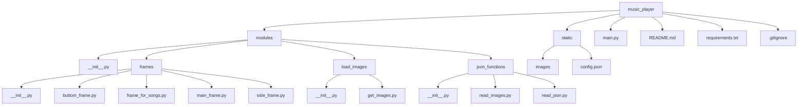

1)тема проекта с какой целью он создавался 
2)как запустить проект(устновка пайтон, установка с гита , создавние вирутального окружения , python main.py)
3)структура requirements описание кажого модуля , с какой целью они используються в проекте
4)схема проекта(figjam or in readme)
5)описание каждого пакета в modules и файлы в нутри пакета(код) , коментарии на англ или на укр 
6)с какой целью каждый файл
7)ссылка на библиотеки где брал информацию
8)какие были проблемы при создании проекта , как решил проблему с которой столкнулся
9)сделать работу над ошибками(потоки , не создавал классы)
10)висновок на укр и на англ(с чем помог проект, как он меня прокачал , чем он был мне полезен)
<a name="articles"><h3>Table of contents</h3></a>

# Project Description  
[Project description](#headers)

# Getting Started  
[Getting started](#getting_started)

# Modules Description  
[Modules description](#modules)

# Project Scheme  
[Scheme of project](#scheme)

# Package Description  
-   [Package description](#package_description)
    - [Frame package](#frame_package)
        -   [File main_frame.py](#main_frame.py)
        -   [File buttom_frame.py](#buttom_frame.py)
            -   [Module description in file button_frame.py](#button_frame_modules)
            -   [Function wich load songs to project](#load_songs)
            -   [Function wich delete songs](#delete_songs)
            -   [Functions for editing volume](#edit_volume)
            -   [Function that play random songs](#random_songs)
            -   [Create buttons for buttom panel](#buttons_buttom_panel)
        -   [File frame_for_songs](#frame_for_songs.py)


# Music PLayer
<a name="headers"><h2>About project</h2></a>

The main goal of developing this program was to improve my skills in working with the customtkinter library and gain 
experience in creating functional applications with an attractive graphical interface in Python.
Of course, this program is not perfect, but this project served as a learning tool to deepen my understanding 
of working with custom interface elements, troubleshooting code issues, and properly organizing files within a project.

Moreover, the development of this project helped me better understand how to work with events and use various libraries 
to create a unified functional application. The result is a music player that can be used as a foundation for further 
improvements and the addition of new features, such as retrieving relevant information from external music services.

<details>
<summary>🇺🇦 Ukrainian version 🇺🇦</summary>
Головною метою розробки цієї програми було вдосконалення своїх навичок роботи з бібліотекою customtkinter, 
та отримання досвіду у створенні функціональних додатків із привабливим графічним інтерфейсом у Python.
Звісно не можна сказати що ця програма ідеальна, але цей проєкт слугував меня як навчальний інструмент для поглиблення 
розуміння роботи з кастомними елементами інтерфейсу, вирішування помилок у коді, та правильною розтановкою файлів.

Окрім того,розробка цього проєкту допомогла краще зрозуміти, як працювати з подіями, 
також використовування різних бібліотек для створення єдиного функціонального додатку. Результатом став музичний плеєр, 
який можна використовувати як базу для подальшого вдосконалення та додавання нових функцій, 
таких як брати потрібну інформацію із зовнішніх музичних сервісів.
</details>

[⬆️Table of contents](#articles) 

<a name="getting_started"><h1>Getting started</h1></a>
Below will be instructions on how you can download this project to your device.

## Installing python
This is an example of how to install python if you never use him
- Download the Python Installer
    - Go to the official [Python website](https://www.python.org)
    - Navigate to the Downloads section. The website automatically detects your operating system and displays the appropriate version.
- Choose the Right Version
    - For most users, the latest stable version is recommended. But if you don't have the latest version, try downloading another one.
- Download the Installer
    - Click on the Download Python button. This button will be in the top right corner of your screen.
- Customize Installation Options 
    - Check the box "Add Python to PATH" at the bottom of the installer window. This step is crucial for running Python from the command line
    - Click Customize installation if you want to select additional options, but the default settings work fine for most users.
- Install python
    - Finnaly you can click the Install Now button and wait for the installation to complete.
- Verify the Installation
    - After installation, open your terminal or command prompt.
        <details>
        <summary> Operating system</summary>
        - On Windows: Press Win + R, type cmd, and press Enter.
        - On macOS/Linux: Open the Terminal application.
        </details>
    - Type ```python --version``` or ```python3 --version``` and press Enter.
    - If Python is installed correctly, you will see the installed version displayed

If you still don't get how to install python, you can watch [here](https://www.youtube.com/watch?v=YKSpANU8jPE)

[⬆️Table of contents](#articles)

## Installing this project
1. Clone the project
    - Went to the main page of project on github.
    - Click the green "Code" button located at the top right.
    - Select the HTTPS option and copy the project URL.
2. Open project in an IDE
    - Launch your preferred IDE(Vscode , PyCharm or another one)
    - Open it , and select "Open Folder" option to navigate to and open the directory where the project was cloned.
    - Press Control + J or just create new terminal , and write this:
    ```python
    git clone <repository_url>
    ```
3. Prepare the project for use
    - Go to the main project folder
        ```python  
        cd music_player
        ```
4. Сreate a virtual environment

    For macOS/Linux:

        python3 -m venv venv
    For Windows:

        python -m venv venv
4. Activate the Virtual Environment

    On macOS/Linux:

        source venv\Scripts\activate
    On Windows:

        venv\Scripts\activate
5. Install Project modules
    - Once the virtual environment is active, install the required libraries by running:

        ``` 
        pip install -r requirements.txt 
        ```
6. Launch program
    - For start the Music Player, use the following command:
        ``` python
        python main.py
        ```
[⬆️Table of contents](#articles)

<a name="modules"><h1>MODULES FOR PROGRAM</h1></a>

### MODULES FOR DOWNLOADING

* **customtkinter** - To create a music player GUI/Для створення графічного інтерфейсу музикального плеєру
* **pygame** - Loading and playing music for music_app/Завантаження та програвання музики для додатку
* **pillow** - For open and process image files before passing them to customtkinter/Для відкриття та обробки файлів зображень перед передачею їх у customtkinter

### BASE MODULES PYTHON

* **os** - searching absolute path
* **threading** - Used to create and manage streams so that you can play music continuously without stuttering or errors/Використовується для створення потоків і керування ними, для того щоб можна було безперервно програвати музику без зависань та помилок
* **random** - Used for the function of playing random music/Використовувся для функції програвання рандомної музики
* **json** - Used for reading JSON files and images for project/Використовувався для отримання необхідної інформації з JSON файлів, а також для зчитування шляхів до зображень.

<a name="scheme"><h1>Scheme of the project</h1></a>

[⬆️Table of contents](#articles)



<a name="package_description"><h1>Package description</h1></a>

<a name="frame_package"><h1>Frame package</h1></a>

After looking at the main scheme of the project, you can now understand why each package and the modules in them are needed.
Let's start with package frames , which contains all the files associated with application frames, and functions that help manage buttons correctly.The first file we will look at in this package will be main_frame.py , which creates the main application window.

<details>
<summary>🇺🇦 Ukrainian version 🇺🇦</summary>
Розглянувши основну схему проекту, тепер ви можете зрозуміти, для чого потрібен кожен пакет і модулі в них.
Почнемо з пакету frames, який містить усі файли, пов’язані з вікнами програми, і функціями, які допомагають правильно керувати кнопками. Першим файлом, який ми розглянемо в цьому пакеті, буде main_frame.py, який створює головне вікно програми.
</details>

<a name="main_frame.py"><h1>main_frame.py</h1></a>
The main_frame.py file is created to initialize the main window of the program and place the main interface elements on it. I can also note that I have specifically allocated this file for the code to improve the structure of the project, making it clearer and easier to maintain. The file is solely responsible for creating the main window of the program, leaving the other functions of the program in separate files.

<details>
<summary>🇺🇦 Ukrainian version 🇺🇦</summary>
Файл main_frame.py створюється для ініціалізації головного вікна програми та розміщення на ньому основних елементів інтерфейсу. Також можу зазначити, що я виділив спеціально цей файл для коду, щоб покращити структуру проекту, зробивши його зрозумілішим і легшим для підтримки. Файл відповідає виключно за створення головного вікна програми, залишаючи інші функції програми у окремих файлах.
</details>


```python
    # Importing module that can create Dekstop programs 
    # Імпортуємо необхідний модуль для створення Dekstop програм
    import customtkinter as ctk
    # Import function that can reades json files
    # Імпортуємо функція яка може читати json файли
    from ..json_functions.read_json import read_json

    # Take a list of information for create window
    # Беремо інформацію  про параметри віна із файлу config.json 
    dict = read_json(filename="config.json")

    print(dict)

    # Take the main parameters from dict which we need to create main window
    # Беремо потрібні параметри зі словаря dict для свторення вікна
    width = dict["main_frame"]["width"]
    height = dict["main_frame"]["height"]
    title = dict["main_frame"]["title"]
    main_frame_color = dict["main_frame"]["fg_color"]

    # Create new window with parameters that we take from dict
    # Створюємо головне вікно за параметрами які отримали
    app = ctk.CTk(fg_color = main_frame_color)
    # Use function that prohibits resizing the window
    app.resizable(width  = False, height = False)

    # Take a size of user screen to place window in the center
    # Дізнаємося інформацію про розмір вікна користувача 
    screen_width = app.winfo_screenwidth()
    screen_height = app.winfo_screenheight()

    # Finds the center coord of screen
    # Знаходимо центральні координати вікна , для розташування програми по центру
    x_coordinate = (screen_width // 2) - (width // 2)
    y_coordinate = (screen_height // 2) - (height // 2)


    # Set the size of the empty window and place it in the center of the screen
    # Задаємо розміру голоному вікну , та розташовуємо його по центру екрана
    app.geometry(f"{width}x{height}+{x_coordinate}+{y_coordinate}")

    # Sets the title of the window
    # Даємо назву вікну
    app.title(title)
```

[⬆️Table of contents](#articles)

After viewing the code of the main window, let's go to the file where we create the buttons located in the bottom panel of the program and their functions.

<details>
<summary>🇺🇦 Ukrainian version 🇺🇦</summary>
Після просмотру коду головного вікна, перейдемо до файлу де створюємо кнопки які розтошавані у нижній панелі програми , та їхніми функціями.
</details>


<a name="buttom_frame.py"><h1>buttom_frame.py</h1></a>

The buttom_frame.py file is a significant part of the music player. It implements functions for loading, playing, 
changing the volume, and randomizing songs. It allows the user to add songs to a playlist from a selected directory, 
display buttons with song names on the screen, and remove songs from the list. Volume control functions (increase and decrease) 
are also included in the interface. The ability to play random songs is built in, taking into account that the same song is not played twice in a row. 
There are also functions for pausing and continuing music playback. Below is a full description of each function in this file.

<details>
<summary>🇺🇦 Ukrainian version 🇺🇦</summary>
Файл buttom_frame.py є значною частиною музичного плеєра. У ньому реалізовані функції для завантаження, відтворення, 
зміни гучності та випадкового відтворення пісень. Він дозволяє користувачеві додавати пісні в плейлист з вибраної директорії, 
відображати кнопки з назвами пісень на екрані, а також видаляти пісні зі списку. Функції регулювання гучності (збільшення та зменшення) 
також включені в інтерфейс. Вбудована можливість відтворення випадкових пісень з урахуванням того, щоб та сама пісня не програвалася
 двічі поспіль. Також є функції для паузи та продовження відтворення музики.Нижче буде написане повний опис кожної функції у цьому файлі.
</details>

[⬆️Table of contents](#articles) 


<a name="button_frame_modules"><h2>Modules that we need for buttom frame</h2></a>

Now we can look at the description of the modules and why I imported them.

<details>
<summary>🇺🇦 Ukrainian version 🇺🇦</summary>
Зараз ми можемо побачити які імпоруються модулі у цьому файлі.
</details>

```python
    # Import module pygame , that can play music
    # Імпортуємо модуль pygame , який дозволяє програвати музику
    import pygame
    # Import module random for randomizing songs
    # Імпортуємо модуль який допоможе рандомно програвати музику
    import random as r
    # Import module os for working with directories
    # Імпортуємо модуль який працює із директоріями
    import os
    # Import module that can create Dekstop programs 
    # Імпортуємо необхідний модуль для створення Dekstop програм
    import customtkinter as ctk
    # Import function that can creates thread 
    # Імпортуємо моудль який може створювати потоки 
    from threading import Thread 
    # Import module that can work with directories of computer
    # Імпортуємо модуль який може працювати із директоріями проєкту
    from customtkinter import filedialog
    # Import main frame , where we places all another frames
    # Імпортуємо головний екран , на якому можемо розташовувати всі інші фрейми
    from .main_frame import app
    # Import images for buttons
    # Імпортуємо зображення для кнопок
    from ..load_images.get_images import image_add_song, image_del_song , image_mix_songs , image_sound_up , image_sound_down
    # Import frame where we places buttons with name of songs
    # Імпортуємо фрейм на якому розташовуємо кнопки із назвами пісень
    from .frame_for_songs import frame_treks , list_songs 
    # Import all lists for manages program
    # Імпортуємо всі лісти які допомогають керувати програмою
    from .side_frame import event_pause , list_check_stop , label_for_show_name, list_flipping_song  , list_for_button, what_event
```

[⬆️Table of contents](#articles) 

<a name="load_songs"><h2>Load songs to the project</h2></a>

The first time I sat down to make a project, the most hard question was how to load music from a computer into the project. 
In this part of the code description, you can see a complete description of this question.

<details>
<summary>🇺🇦 Ukrainian version 🇺🇦</summary>
Коли я вперше сів за проект, найскладнішим питанням було, як завантажити в проект музику з комп’ютера.
У цій частині опису коду ви можете побачити повний опис цього питання.
</details>

```python
# A function wich load songs from your computer to music player
# Функціія яка завантажує музику з комп'ютера до музикального плеєра
def open_songs():
    # Choise from wich directory songs will loads to project
    # Запитуємо у користувача із якої дирикторії будемо завантажувати музику
    path = filedialog.askdirectory()
    # Checking that the user does not select an empty directory
    # Перевірка на те , щоб користувач не вибрав пусту директорію
    if path != None:
        name = ""
        # Chdir - the command changes the current working directory to the one specified in the path variable so that pygame can play music by name
        # Chdir - яка команда змінює поточну робочу директорію на вказану в змінній path , щоб pygame міг програвати музику за назвою
        os.chdir(path)
        # os.listdir - a function in Python that returns a list containing the names of the entries in the directory given by path.
        #listdir - команда повертає список файлів та папок, що знаходяться у вказаній директорії path
        songs = os.listdir(path)
        # We go through all the files and check that they have the mp3 extension
        #Перебираємо усі файли , та перевіряємо щоб вони були із розширенням mp3
        for song in songs: 
            if song.endswith(".mp3"):
                # If this is the case, then split the file into name and extension
                # Якщо це так, то розбиваємо файл на ім'я та розширення
                name , file = song.split(".mp3")
                # Create a button with song name ,  - so that the button contains the names of the songs in order, and not just the last one
                # Створення кнопки з назвою пісні , lambda - щоб кнопка містила назви пісень по порядку, а не лише останню
                button = ctk.CTkButton(master= frame_treks , text = name , command=lambda name_of_button = name:change_name_button(name_of_button= name_of_button))

                # Add button to the list of buttons
                # Додаємо кнопку до списку із кнопками
                list_for_button.append(button)

                # Add song to the list for songs
                # Додаємо пісню до списку пісень
                list_songs.append(song)

            # Pack buttons in frame_treks to display them on the screen
            # Розташовуємо кнопки із піснями за допомогою циклу, та робимо відступи у 10 пікселів
            for song in list_for_button:
                song.pack(pady = 10)

```

[⬆️Table of contents](#articles) 


<a name="delete_songs"><h2>Deleting song from music player</h2></a>

If you were to ask me which part of the project was the most difficult, I would say without hesitation that it was the song removal function.

In the first version of this function, I encountered a problem that all buttons were only passed the same song title, regardless of which button was pressed. I searched for a solution for several days and finally realized that the best option would be to use lambda functions for each button. This allowed me to determine exactly which button was pressed and remove the desired song accordingly.

Below you can see the complete solution to this problem.

<details>
<summary>🇺🇦 Ukrainian version 🇺🇦</summary>
Якщо б мене запитали, яка частина проєкту була найскладнішою, я б без вагань відповів, що це функція видалення пісень.

У першій версії цієї функції я зіткнувся з проблемою , що для всіх кнопок передавалася лише одна й та сама назва пісні, незалежно від того, яку саме кнопку натискали. Я шукав рішення кілька днів і, зрештою, зрозумів, що найкращим варіантом буде використання lambda-функцій для кожної кнопки. Це дозволило мені точно визначати, на яку саме кнопку натиснули, і відповідно видаляти потрібну пісню.

Нижче ви можете побачити повне рішення цієї задачі.
</details>

```python
# List for manage what song need to del
# Ліст для того , щоб контролювати яку пісню треба видаляти
check_del = [False]

# A function that is immediately added for all buttons in the list_sons list; the name_of_button parameter contains the name of the button that was clicked
# Функція, яка відразу додається для всіх кнопок у списку list_sons, у параметрі name_of_button лежить назва кнопки на яку натиснули
def change_name_button(name_of_button):
    # Checking whether you clicked on the delete songs button
    # Перевіряємо чи натиснули на кнопку видалення пісень
    if check_del[0] == True:      
        # We go through the list of buttons with the names of songs to find out which one was clicked
        # Перебираємо всі кнопки з назвами пісень, та перевіряємо чи текуща кнопка совпадает с кнопкой которую нажали, та якщо так, то видаляємо її
        for button in list_for_button:
            # If the song you searched for coincides with the one you clicked on, then delete it
            # Якщо пісня яку перебирали збіглася з тією на яку натиснули, то видаляємо її
            if button._text == name_of_button:
                # If we find the right button, destroy it
                # Якщо нагшли на яку кнопку настиснули , то видаляємо її
                button.destroy()
                # Also delete a song from the list_songs
                # Також видаляємо пісню із списку де зьерігаються усі пісні, щоб її не можна було програти
                list_songs.remove(name_of_button + ".mp3")
                # Also delete the button from the list_for_button
                # Видаляємо кнопку із списка де зберігаються усі кнопки
                list_for_button.remove(button)
                # Transfer the click of the delete button False to the tracking list, so that the next song can be deleted only by clicking on the button
                # Передаємо у список відстеження натискання кнопки видалення False, щоб наступну пісню можна було видалити лише після натискання на кнопку
                check_del[0] = False
            # If already we don't have any buttons in list , clear all list
            # якщо в списку де зберігаються усі кнопки пустий, то очищаємо список
            elif len(list_songs) < 1:
                list_for_button.clear()
                
# if check_del is False, it means the delete button was not pressed
# якщо в check_del лежить False то значить кнопку видалення не натиснули
def delete_song():
    # transmit True to say that the button was pressed
    # передаємо True щоб сказати що натиснули на кнопку
    check_del[0] = True
```

[⬆️Table of contents](#articles) 


<a name="edit_volume"><h2>Volume Editing</h2></a>

The volume functions implement an intuitive approach to controlling the sound level.
First, we get the current volume level and store it in the list_for_volume so that we can change this value in the future.

The add_volume function increases the volume by 0.1 and applies the new value. If the level exceeds the maximum allowable volume, it is automatically set to 1.

The minus_volume function does the same thing, but decreases the volume by 0.1. If the level falls below the minimum value, it is set to 0 to avoid incorrect player operation.

This approach provides smooth sound adjustment and protection against incorrect volume values

 <details>
 <summary>🇺🇦 Ukrainian version 🇺🇦</summary>
У функціях зміни гучності реалізовано інтуїтивно зрозумілий підхід для управління рівнем звуку.
Спочатку ми отримуємо поточний рівень гучності  і зберігаємо його в список list_for_volume, щоб мати можливість змінювати це значення в майбутньому.

Функція add_volume збільшує гучність на 0.1 і застосовує нове значення. Якщо рівень перевищує максимальну допустиму гучність, він автоматично встановлюється на 1.

Функція minus_volume діє аналогічно, але зменшує гучність на 0.1. Якщо рівень падає нижче мінімального значення, він встановлюється на 0, щоб уникнути некоректної роботи програвача.

Цей підхід забезпечує плавне регулювання звуку та захист від некоректних значень гучності
 </details>

```python
# We get what the current volume of the sound is
# Отримуємо яка зараз гучність звуку
volume = pygame.mixer.music.get_volume()
# Save the volume to list
# Зберігаємо гучність у список
list_for_volume = [volume]
# Set volume from the data i list
# Встановлюємо гучність звуку за парметром із списку
pygame.mixer.music.set_volume(list_for_volume[0])

#Fucntion for add volume
# Функція додавання гучності 
def add_volume(): 
    # increase volume by 0.1
    # збільшуємо гучність звуку на 0.1
    list_for_volume[0] += 0.1
    # set the new volume into the mixer music
    # встановлюємо нову гучність звуку 
    pygame.mixer.music.set_volume(list_for_volume[0])
    print(list_for_volume[0])
    # If make volume more the max volume , take it the 1
    # Якщо ми превисили гучність звуку , то встановлюємо 1
    if list_for_volume[0] > 1.1:
        list_for_volume[0] = 1
        pygame.mixer.music.set_volume(list_for_volume[0])


# Function that reduces the volume
# Функція яка зменшує гучність 
def minus_volume():
    # decrease volume by 0.1
    # зменшуємо гучність звуку на 0.1
    list_for_volume[0] -= 0.1
    # set the new volume into the mixer music
    # встановлюємо нову гучність звуку
    pygame.mixer.music.set_volume(list_for_volume[0])
    print(list_for_volume[0])
    # If make volume less the 0, take it the 0
    # Якщо зробили гучність звуку менш ніж 0,01 , то встановлюємо гучність на 0
    if list_for_volume[0] < 0.01:
        list_for_volume[0] = 0
        pygame.mixer.music.set_volume(list_for_volume[0])
```

[⬆️Table of contents](#articles) 


<a name="random_songs"><h2>PLay random songs</h2></a>

 Now we can look at the random song playback function. In my opinion, this part of the file is perhaps the most difficult in this file. It selects a song that has not yet been played and plays it, changing the song name on the screen. If the song was paused, the function unpauses and continues playing from the place where it was stopped. The function also takes into account the possibility of skipping songs or returning to the previous one through the corresponding interface buttons. All songs that have already been played are added to the list to avoid repetitions. You can see the full code description below

 <details>
 <summary>🇺🇦 Ukrainian version 🇺🇦</summary>

 Тепер можемо подивитися функцію програвання рандомних пісень.На мою думку ця частина файлу є чи не найтяжчей у цьому файлі.Вона вибирає пісню, яку ще не грали, і відтворює її, змінюючи назву пісні на екрані. Якщо пісня була поставлена на паузу, функція знімає паузу і продовжує відтворення з того місця, де було зупинено. Функція також враховує можливість пропуску пісень або повернення до попередньої через відповідні кнопки інтерфейсу. Всі пісні, що були вже програні, додаються до списку, щоб уникнути повторів. Повний опис коду можете продивитися нижче
 </details>


 <details>
 <summary>Function code of random playing songs</summary>

 ```python
 # Function for playing random song
# Функція для програввання рандомної музики
def random_song():
    # set a list what_event to "random"
    # передаємо у ліст what_event значення "random", це значить що зараз пісні грають на рандом
    what_event[0] = "random"
    # get the initial length of the list of songs
    # отримуємо початкову довжину списку із піснями 
    static_len_list_songs = len(list_songs)
    # a checklist to make sure the same song doesn't play twice
    # список для перевірки щоб не грала одна та тажа пісня два рази
    same_song_list = [None]
    # list of what random song is playing now
    # список яка зараз рандомна пісня грає
    list_for_random_song = [None]
    # leet for storing the previous song
    # лист для зберігання попередньої пісні
    prev_song = [""]
    #if the song was paused and we pressed play again, then the song would start playing from the last moment it was paused
    #якщо пісня була поставлена ​​на паузи і ми знову натиснули на грати, то щоб пісня почала грати з останнього моменту зупинки
    if not event_pause.is_set():
        #we set True into event_pause (we say that we took the song off pause)
        # задаємо True into event_pause (кажемо, що зняли пісню з паузи)
        event_pause.set()
        # unpause the music
        pygame.mixer.music.unpause()
    # If there is no break now, then we just play random songs
    # якщо зараз не пауза, то просто відіграємо рандомні пісні
    else:
        # we make an infinite loop so that the songs play until the stop button is pressed, or until they end
        # робимо нескінченний цикл , для того щоб пісні відігравалися доки не натиснута кнопка стоп, або поки вони не закінчаться
        while True:
            #if there is something stored in the storage list before the last song, then we play the last song before
            #якщо у списку зберігання пред останньої пісні щось зберігається то вілаграємо пред останню пісню
            if prev_song[0] != "":
                # split the song into the name and file extension to output only the song name
                # ділимо пісню на назву та розширення файлу, щоб виводити лише назву пісні
                name , file  = prev_song[0].split(".mp3")
                #Change the label text to show the name of the song currently playing to the name of the previous song
                #Змінюємо текст label для показу назви пісні яка зараз грає , на назву предостаньї пісні
                label_for_show_name.configure(text = name)
                # Play the previous song
                # Відіграємо предостанню пісню
                pygame.mixer.music.load(prev_song[0])
                pygame.mixer.music.play()
                # transfer the current song, previous music to the list
                # Передаємо у список поточної пісні , попередню музику
                list_for_random_song[0] = prev_song[0]
            # If the user hasn't flipped through the songs, we'll just play the next random song.
            # Якщо користувач не перегортав пісні, то просто програємо наступну рандомну пісню
            elif list_for_random_song[0] == same_song_list[-1]:
                if same_song_list[0] == None:
                    same_song_list = []
                
                # Select the next random song from the list
                # Вибираємо наступну рандомну пісню із списку
                list_for_random_song[0] = r.choice(list_songs)
                # doing a search for songs in the list of songs that have already been played
                # Робимо перебор пісень у списку пісень які вже грали
                for same_song in same_song_list:
                    # If such music has already been played, then we randomly select other music that has not been played yet.
                    # Якщо така музика вже грала, то вибираємо рандомно іншу музику якої ще не грала
                    if same_song == list_for_random_song[0]:
                        # do an infinite loop until we find a song that hasn't been played yet
                        # Робимо бескінечний цикл поки не знайдемо пісні яка ще не грала
                        while list_for_random_song[0] in same_song_list:
                            list_for_random_song[0] = r.choice(list_songs)

                # Add the song to the list of songs that have already been played so that it will not be played again next time
                # Додаємо пісню до списку пісень які вже грали , щоб у наступний раз вона вже не грала
                same_song_list.append(list_for_random_song[0])
                # split the song into the name and file extension to output only the song name
                # ділимо пісню на назву та розширення файлу, щоб виводити лише назву пісні
                name , file  = list_for_random_song[0].split(".mp3")
                #Change the label text to show the name of the song that should be playing now.
                #Змінюємо текст label для показу назви пісні яка зараз повинна грати
                label_for_show_name.configure(text = name)
                # Play the selected song
                # Завантажуємо та відіграємо пісню яку вибрали із списку list_songs
                pygame.mixer.music.load(list_for_random_song[0])
                pygame.mixer.music.play()
            
            #If the user scrolled back through the page and now scrolls forward, then execute the code below
            #Якщо користувач перегортав пісін назад , а зараз перегортає у перед , то виконує код нижче
            elif list_for_random_song[0] != same_song_list[-1]:
                #Looking for the song index of the song currently playing
                #Шукаємо індекс пісні яка зараз пісня грає
                index_next_song = same_song_list.index(list_for_random_song[0])
                # By adding to index 1 , select the next song
                # Через додавання до індексу 1 , вибираємо наступну пісню 
                next_song = same_song_list[index_next_song + 1]
                # Update the current song
                # Оновлюємо поточну пісню
                list_for_random_song[0] = next_song
                # split the song into the name and file extension to output only the song name
                # ділимо пісню на назву та розширення файлу, щоб виводити лише назву пісні
                name , file  = next_song.split(".mp3")
                #Change the label text to show the name of the song that should be playing now
                # Змінюємо текст label для показу назви пісні яка зараз повинна грати
                label_for_show_name.configure(text = name)
                # Play the next song
                # Завантажуємо та відіграємо наступну пісню
                pygame.mixer.music.load(next_song)
                pygame.mixer.music.play()
            
            # clear the list for previous song
            # очищаємо список для зберігання попередньої пісні
            prev_song[0] = ""

            # iterate through the list of buttons with song names to understand which one is currently playing
            # Робимо перебор списку кнопок із назвами пісень, щоб зрозуміти яка зараз грає
            for button in list_for_button:
                try:
                    #if the button text matches the lyrics of the song we are currently playing, then we change its color to orange
                    #якщо текст кнопки співпадє з текстом пісні яка зараз граємо, то змінюємо її колір на оранжевий
                    if button._text == label_for_show_name._text:
                        button.configure(fg_color = "orange")
                    #For other buttons, change the color to blue
                    #Для інших кнопок змінюмо колір на синій
                    else:
                        button.configure(fg_color = "#3b8ecf")
                except Exception as error:
                    print(error)
            # make an infinite loop while the music is playing, so that it always plays to the end, and does not immediately skip to the next one
            # Робимо нескінчений цикл поки грає музика, щоб вона зажди грала до кінця , а не одразу перегорталась на наступну
            while pygame.mixer.music.get_busy():  
                # If the user presses the pause button, pause the music and wait until the user presses it again to resume
                # Якщо користувач натиснув кнопку паузи, призупиніть музику та зачекайте, доки користувач не натисне її знову, щоб відновити
                if not event_pause.is_set():
                    pygame.mixer.music.pause()
                    #stop the thread, and it will continue only if evebt_pause is True(event_pause.set()), that is, we will unpause
                    #Зупиняємо потік, і він продовжиться тільки в тому випадку, коли в evebt_pause буде True(event_pause.set()) , тобто знімемо з паузи
                    event_pause.wait()
                # If user presses the "next_song" button , skip the current iteration
                # Якщо користувач натиснув кнопку "наступна пісня", пропускаємо поточний цикл
                if list_flipping_song[0] == True:
                    if len(same_song_list) >= static_len_list_songs:
                        pass
                    else:
                        list_flipping_song[0] = False
                        pygame.mixer.music.stop()
                        continue
                
                # If user presses the "previous_song" button , thne make the codes below
                # Якщо користувач натиснув кнопку "попередня пісня" , робимо код нижче
                if list_flipping_song[0] == "Back":
                    # Stop the music
                    # Зупиняємо музику
                    pygame.mixer.music.stop()
                    #clear the list to store the state of which button is pressed (forward or back)
                    #очищаємо список для зберігання стану яка кнопка нажата(вперед , або назад)
                    list_flipping_song[0] = False
                    # Search an index of current song
                    # Шукаємо індекс пісні яка зараз грає
                    index_song = same_song_list.index(list_for_random_song[0])
                    # If thiis is a first song in the list , just choise again the first song
                    # Якщо це перша пісня в списку, просто знову виберіть першу пісню
                    if index_song < 1:
                        prev_song[0] = same_song_list[index_song]
                    # If it is not the first song in the list , search an index of previous song
                    # Якщо це не перша пісня в списку, знайдіть індекс попередньої пісні
                    else:
                        prev_song[0] = same_song_list[index_song - 1]
                    print(prev_song[0])
               
                # If in the list of check button "stop" more then 1 , it's mean program have to stop the music
                # Якщо в списку перевірочних кнопок «стоп» більше 1, це означає, що програма повинна зупинити музику
                if list_check_stop[0] > 0:
                    # Stop the music
                    # Зупиняємо музику
                    pygame.mixer.music.stop()
                    # Clear the list of check button "stop"
                    # Очищаємо список для перевірки кнопки «стоп»
                    list_check_stop[0] = 0
                    # Change the text of label wich show what song is playing to "Stop" 
                    # Змініть текст мітки, яка показує, яка пісня відтворюється, на "Зупинити"
                    label_for_show_name.configure(text = "Stop")
                    # Exit from loop 
                    # Виходимо із циклу
                    exit()

            # If the list wich save what song alread played more or equal to list of list_songs , exit from the loop
            # Якщо список, який зберігає пісні, які вже грали, більше або дорівнює списку list_songs, вийдіть із циклу
            if len(same_song_list) >= static_len_list_songs:
                print("End of song list")
                break
            pygame.mixer.music.stop()
       
#Function wich create a thread to play random songs
# Функція яка створює та запускає поток для відігравання рандомних пісень
def random_music_theread():
    # Create a thread
    # Створюємо поток 
    random_music = Thread(target = random_song)
    # Start the thread
    # Запускаємо поток
    random_music.start()
 ```
 </details>

 [⬆️Table of contents](#articles) 


<a name="buttons_buttom_panel"><h2>Create Buttons for buttom panel</h2></a>

The last part of this file is responsible for creating and placing the buttons in the bottom row of the interface, located in the frame_buttom. Each button performs a specific action, such as adding or removing a song, shuffling a song, or adjusting the volume.
Thus, the use of the program becomes clear, and controlling songs, playback, and sound settings is more convenient with the program interface.

<details>
<summary>🇺🇦 Ukrainian version 🇺🇦</summary>
Остання частина цього файлу відповідає для створення та розташування кнопок у нижньому ряду інтерфейсу, що знаходиться у фреймі frame_buttom. Кожна кнопка виконує певну дію, наприклад, додавання або видалення пісні, змішування пісні або регулювання гучності.
Таким чином, використання програми стає зрозумілим, а керування піснями, відтворенням та налаштуваннями звуку зручнішим з інтерфейсом програми.
</details>

<details>
<summary>The code of creating buttons for buttom panel</summary>

```python
# Create a frame for the bottom row of buttons
# Створюємо фрейм  де будемо розставляти кнопки 
frame_buttom = ctk.CTkFrame(master = app , width = 405 , height = 58 , fg_color = "#4cb7ce")
# place this frame at the desired coordinates
# Створюємо фрейм для кнопок які розташовані у нижньому ряду
frame_buttom.place(x = 25 , y = 397)

# Adjust the grid to correctly position objects in this frame
# Робимо налаштування сітки для правильного розтагування об'єктів в цьому фреймі
frame_buttom.columnconfigure((0,1,2,3,4), weight = 1) #| | | | |
frame_buttom.rowconfigure(0 , weight = 1) # -

# Create a button to add songs to project
# Додаемо кнопку яка буде завантажувати пісні до проєкту
buttom_add = ctk.CTkButton(master = frame_buttom , 
                           text= "" ,
                           width = 61 , 
                           height = 58, 
                           fg_color= "#bdbdbd", 
                           border_color = "black" , 
                           corner_radius = 20, 
                           border_width = 4, 
                           image = image_add_song , 
                           anchor = "center" , 
                           command = open_songs)
# Place it in the first(0) row and first(0) column
# Розташоваємо її у першому рядку та першій колонці
buttom_add.grid(row = 0 , column = 0 , padx = (0 , 25))


# Create a button to delete songs from project
# Створюємо кнопку яка буде видаляти пісні
buttom_delete = ctk.CTkButton(master = frame_buttom , 
                              text= "" , 
                              width = 61 , 
                              height = 58, 
                              fg_color= "#bdbdbd", 
                              border_color = "black" , 
                              corner_radius = 20, 
                              border_width = 4, 
                              image = image_del_song , 
                              anchor = "center",
                              command = delete_song)
# Place it in the first(0) row and second(1) column
# Розташоваємо її у першому рядку та у другій колонці
buttom_delete.grid(row = 0 , column = 1 , padx = (0 , 25))


# Create a button to play random songs
# Створюємо кнпоку яка буде рандомно видігравати пісні
buttom_mix = ctk.CTkButton(master = frame_buttom , 
                           text= "" , 
                           width = 61 , 
                           height = 58, 
                           fg_color= "#bdbdbd", 
                           border_color = "black" , 
                           corner_radius = 20, 
                           border_width = 4, 
                           image = image_mix_songs , 
                           anchor = "center", 
                           command = random_music_theread
                           ) 
# Place it in the first(0) row and third(2) column
# Розташоваємо її у першому рядку та третій колонці
buttom_mix.grid(row = 0 , column = 2, padx = (0 , 25))

# Create button for volume up
# Створюємо кнопку яка буде підвищує гучність
button_sound_up = ctk.CTkButton(master = frame_buttom , 
                                text= "" , 
                                width = 61 , 
                                height = 58, 
                                fg_color= "#bdbdbd", 
                                border_color = "black" , 
                                corner_radius = 20, 
                                border_width = 4, 
                                image = image_sound_up , 
                                anchor = "center", 
                                command = add_volume
                                )
# Place it in the first(0) row and fourth(3) column
# Розташоваємо її у першому рядку та четвертій колонці
button_sound_up.grid(row = 0 , column = 3 , padx = (0 , 25))


# Create button for volume down
# Створюємо кнопку яка робить гучність ниже
button_sound_down = ctk.CTkButton(master = frame_buttom , 
                                  text= "" , 
                                  width = 61 , 
                                  height = 58, 
                                  fg_color= "#bdbdbd", 
                                  border_color = "black" , 
                                  corner_radius = 20, 
                                  border_width = 4, 
                                  image = image_sound_down , 
                                  anchor = "center", 
                                  command = minus_volume
                                  )
# Place it in the first(0) row and fifth(4) column
# Розташоваємо її у першому рядку та п'ятій колонці
button_sound_down.grid(row = 0 , column = 4)
```

</details>

 [⬆️Table of contents](#articles) 

 <a name="frame_for_songs.py"><h1>frame_for_songs.py</h1></a>

 The file frame_for_songs.py is an important part of the music player. It creates and displays a 
 frame that contains buttons with the names of the loaded songs. This file is responsible for organizing
 the interface for interacting with the user's playlist.
Below is a complete description of each element of this file.

<details>
<summary>🇺🇦 Ukrainian version 🇺🇦</summary>
Файл frame_for_songs.py є важливою частиною музичного плеєра. У ньому створюється та відображається фрейм, 
який містить кнопки з назвами завантажених пісень. Цей файл відповідає за організацію інтерфейсу для взаємодії з плейлистом користувача. 
Нижче наведений повний опис кожного елемента цього файлу.
</details>

```python
# Import module that can create Dekstop programs 
# Імпортуємо необхідний модуль для створення Dekstop програм
import customtkinter as ctk
# Import the main frame in the ptoject , where we place all another frames with objects
# Імпортуємо головний фрейм у проєкті, де розташовуємо усі інші фрейми із об'єктами
from .main_frame import app

# Create list for loaded songs
# Створюємо список де зберігаються усі завантажені пісні 
list_songs = []


# Create frame where place buttons with name songs
# Створюємо фрейм де будуть розташовуватися кнопки із назвами пісень
frame_treks = ctk.CTkScrollableFrame(app, 
                           width = 200, 
                           height = 318 , 
                           corner_radius = 20 , 
                           border_color= "black", 
                           border_width= 4 , 
                           fg_color= "#bdbdbd")
# Place it in the main frame
# Розташовуємо його на головному вікні
frame_treks.place(x = 14 , y = 15)
```

 [⬆️Table of contents](#articles) 


    


        


```
hahahahahahah
```

```python
    print(dfkmfd)
    def ():
        print()
```

<a href="https://fonts.google.com/selection"></a>

<a >

<!-- start:code block -->
# Clone this repository
git clone https://github.com/Pranichek/Music_player
cd papermark

# Install dependencies
npm install

# Copy the example .env file
cp .env.example .env

# Initialize the database
npx prisma generate
npx prisma db push

# Run the app
npm run dev

# Open https://github.com/Pranichek/Music_player in your browser
open https://github.com/Pranichek/Music_player
<!-- end:code block -->


## Getting started
*This is readme file about my project music player.*


**This is readme file about my project music player.**


***This is readme file about my project music player.***

~~*__This is readme file about my project music player.__*~~


Привет это [обычная ссылка в строке](https://www.google.com)

- Первый 1. Пункт 1.
- Второй 1. Пункт 2.
- Третий 1. Пункт 3.


- [X] Write music player
- [ ] nothing
- [X] add thread


- Уровень списка 1. Пункт 1.
    - Уровень списка 2. Пункт 1.
- Уровень списка 1. Пункт 2.
    - Уровень списка 2. Пункт 1.
    - Уровень списка 2. Пункт 2.
- Уровень списка 1. Пункт 3.
    - Уровень списка 2. Пункт 1.
        - Уровень списка 3. Пункт 1.
        - Уровень списка 3. Пункт 2.
           - Уровень списка 4. Пункт 1.